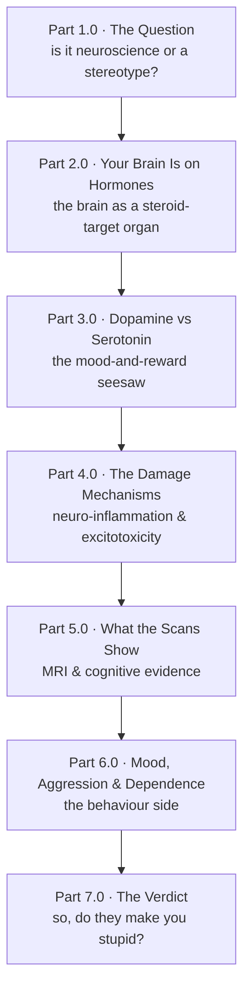

> [!abstract] This is the hub for **Do Steroids Make You Stupid?** inside [[I'm Just Curious — Series Hub|I'm Just Curious]]. It is the *brain* companion to the [[Hormonal Steroids — Series Hub|Hormonal Steroids]] thread. That one asked what a steroid is and how the body builds and uses it. This one asks the next question: what does flooding the system with these molecules do to the organ that runs you? Curiosity-only, no protocols, no doses.

## Why I went down this hole

There is a stereotype baked so deep into gym culture that nobody questions it: the "meathead." Big body, slow brain. The unspoken assumption that the same stuff that builds the muscle quietly dims the lights upstairs.

Then a creator I follow, VigorousSteve, dropped a two-hour deep-dive titled "Do Roids Make You Stupid?" walking through neuro-inflammation, excitotoxicity, dopamine versus serotonin, and the brain-scan evidence.[^steve] And the question would not leave me alone: is "roids fry your brain" an actual neuroscience finding, or is it a lazy stereotype that survives because it sounds right?

So this is me trying to answer it honestly. Not "are steroids bad" (the [[Part 1.0 - The Decision|Performance Enhancement]] series already handles risk and responsibility). The narrower, more interesting question: **is there a real, mechanistic story for how anabolic steroids change the brain, and does that story actually add up to "stupider"?**

It turns out the brain is one of the most steroid-sensitive organs you own, which is exactly why the question is worth taking seriously instead of laughing off.

## The arc

Seven parts, building from "why this is even plausible" up to an honest verdict.

- **Part 1.0 (built) — [[Part 1.0 - The Question|The Question]].** Why this is a fair question and not just a stereotype: the brain is full of steroid receptors and even makes its own. Splitting "stupid" into three separate questions (cognition, mood, structure), and the two routes by which steroids could change the brain.
- **Part 2.0 — Your Brain Is on Hormones.** The brain as a steroid-target organ: where the receptors sit, what neurosteroids are, and how sex hormones tune learning machinery (LTP and LTD). The mechanistic reason hormones reach your thoughts at all. (Leans on the [[Hormonal Steroids — Series Hub|Hormonal Steroids]] thread.)
- **Part 3.0 — Dopamine vs Serotonin.** The reward-and-mood seesaw, and how a flood of androgens can tilt it. This is where the neurochemistry studies (including the reward-circuitry work in the Sayin review) do their work.[^sayin]
- **Part 4.0 — The Damage Mechanisms.** How harm could physically happen: neuro-inflammation, oxidative stress, and glutamate excitotoxicity at supraphysiological doses. The "could it actually injure neurons?" chapter.
- **Part 5.0 — What the Scans Show.** The empirical evidence: accelerated brain ageing, amygdala changes, altered connectivity, and how long-term users actually perform on cognitive tests.
- **Part 6.0 — Mood, Aggression and Dependence.** The behaviour side: "roid rage" examined honestly, withdrawal and depression, and why dependence runs through the same dopamine circuitry.
- **Part 7.0 — The Verdict.** Putting it together without flinching: what's dose- and duration-dependent, what looks reversible versus lasting, what's genuinely established versus extrapolated, and what "stupid" honestly does and doesn't mean here.

## What this series is not

> [!danger] Read this before anything else
> This is curiosity-driven neuroscience, not medical advice and not a protocol. No doses, no sourcing. I'm reasoning about mechanisms and evidence, not telling anyone what to do. Anabolic-androgenic steroids are prescription-only or illegal without a prescription in most jurisdictions, Malaysia included, and carry real risks (the [[Part 1.0 - The Decision|Performance Enhancement]] series covers those responsibly).

> [!note] On the sources, honestly
> This series is *inspired by* one creator's deep-dive and *features* one researcher's neurochemistry framework, but it does not take either as gospel. VigorousSteve's video[^steve] is the spark. The Sayin review[^sayin] is a useful map of reward neurochemistry, but it is a single-author paper in a low-tier journal whose bigger claims are the author's own hypotheses. So throughout, I lean on the **primary literature** for the load-bearing facts and flag clearly where a claim is established science versus one person's model. That "honest about the edges" rule is the whole point of [[I'm Just Curious — Series Hub|this space]].

---

[^steve]: VigorousSteve (with Kurt Havens and Dr Dean St Mart), "Do Roids Make You Stupid? Neuro-Inflammation, Excitotoxicity, Dopamine Vs Serotonin, Brain Deep-Dive," YouTube (https://www.youtube.com/watch?v=iuVG0JRzAB0). The framing spark for this series.

[^sayin]: Sayin, H. Ümit. "Neurological Correlates and the Mechanisms of Expanded Pleasures in Women: Novel Findings on ESR." *EC Neurology* 11.6 (2019): 419–422 (https://ecronicon.net/assets/ecne/pdf/ECNE-11-00520.pdf). Used here for its survey of reward neurochemistry (dopamine, oxytocin, serotonin), with the caveat that its headline ESR claims are the author's own hypotheses rather than established consensus.
