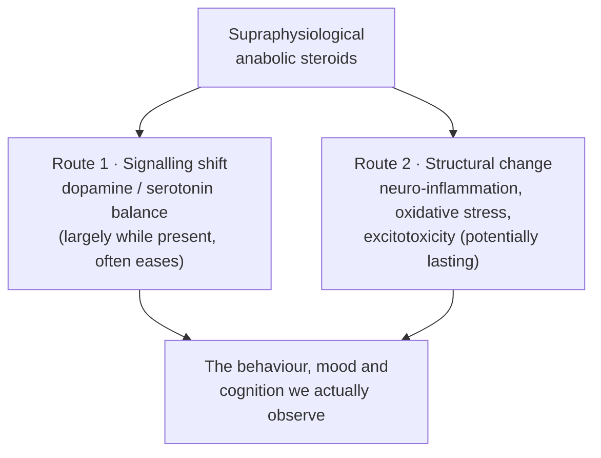

> [!abstract] This is **Part 1.0 of 7** in [[Do Steroids Make You Stupid — Series Hub|Do Steroids Make You Stupid?]], a thread inside [[I'm Just Curious — Series Hub|I'm Just Curious]]. It is the brain companion to the [[Hormonal Steroids — Series Hub|Hormonal Steroids]] thread. The path:
>
> - **Part 1.0 (this article):** The Question
> - **Part 2.0:** Your Brain Is on Hormones (the brain as a steroid-target organ)
> - **Part 3.0:** Dopamine vs Serotonin
> - **Part 4.0:** The Damage Mechanisms (neuro-inflammation & excitotoxicity)
> - **Part 5.0:** What the Scans Show
> - **Part 6.0:** Mood, Aggression and Dependence
> - **Part 7.0:** The Verdict

> [!danger] Framing
> Curiosity-driven neuroscience, not medical advice and not a protocol. No doses, no sourcing. The applied risk conversation lives in the [[Part 1.0 - The Decision|Performance Enhancement]] series. Here, we're only asking whether the "roids fry your brain" idea has real mechanisms behind it.

---
## Table of Contents

- [The meathead and the question hiding inside it](#the-meathead-and-the-question-hiding-inside-it)
- [Why this is a fair question, not a stereotype](#why-this-is-a-fair-question-not-a-stereotype)
- [What "stupid" actually means (three questions, not one)](#what-stupid-actually-means-three-questions-not-one)
- [The two ways a steroid could change a brain](#the-two-ways-a-steroid-could-change-a-brain)
- [A word on evidence, before we get excited](#a-word-on-evidence-before-we-get-excited)
- [Why I find this worth chasing](#why-i-find-this-worth-chasing)
- [Part 1.0 Takeaways](#part-10-takeaways)
- [Where this goes next](#where-this-goes-next)
- [Sources and references](#sources-and-references)

---
## The meathead and the question hiding inside it

There is a stereotype so old that it has stopped feeling like a claim and started feeling like common sense: the **meathead**. Big body, dim bulb. The quiet assumption that whatever builds the muscle must, somewhere along the way, be dimming the lights upstairs.

Most stereotypes are lazy. But this one points at a real, answerable question, and that is what caught my attention. A creator I follow, VigorousSteve, put out a two-hour deep-dive titled "Do Roids Make You Stupid?" working through neuro-inflammation, excitotoxicity, dopamine versus serotonin, and what brain scans actually show.[^steve] Two hours. On a question most people answer with a shrug and a joke.

So I wanted to sit with it properly. Not the moral question (the [[Part 1.0 - The Decision|Performance Enhancement]] series already covers whether and how to use these compounds responsibly). The mechanistic one: **is there a real neuroscience story for how anabolic steroids change the brain, and does that story honestly add up to "stupider," or does it fall apart when you look closely?**

The honest answer, as we'll build over this series, is "it's complicated, and the interesting part is exactly where it's complicated." But before any of that, we have to deal with a prior question: is it even biologically plausible that a muscle-building hormone reaches your *thinking*? Because if the brain were sealed off from these molecules, the whole stereotype would collapse on contact, and we could go home.

It is not sealed off. Not even close.

---
## Why this is a fair question, not a stereotype

Here is the fact that turns "roids and your brain" from gym-bro folklore into a legitimate neuroscience question: **the brain is one of the most steroid-responsive organs in your body.** It is not a bystander to your hormones. It is a primary target.

Three things make that concrete.

**The brain is carpeted with steroid receptors.** Receptors for estrogens, androgens, progestogens and glucocorticoids are distributed throughout the brain, with especially high concentrations in the hypothalamus, the preoptic area, and the limbic system (the emotional and memory core), as well as the hippocampus and cortex.[^receptors] These are not decorative. A receptor is a docking port that lets a hormone reach inside a neuron and change which genes it runs (the genomic mechanism from the [[Part 1.0 - What a Steroid Hormone Actually Is|Hormonal Steroids]] thread). Wherever there is a receptor, a hormone has a lever.

**The brain makes its own steroids.** Beyond what arrives from the bloodstream, the brain synthesises steroids locally, on site. These are called **neurosteroids**: for example, certain hippocampal neurons express aromatase and produce estrogen right there in the tissue.[^neurosteroid] The brain is not just *exposed* to steroids; it is partly *run* on them.

**Those steroids tune the machinery of learning itself.** This is the detail that made me stop and reread. The cellular events behind learning and memory, long-term potentiation (LTP, strengthening a synapse) and long-term depression (LTD, weakening one), are themselves steroid-sensitive: work in the hippocampus has found that LTP leans on estrogen-receptor signalling while LTD and depotentiation lean on androgen-receptor signalling.[^neurosteroid] In other words, sex hormones are wired directly into the dials that decide what you remember and what you let fade.

> [!note] The plausibility verdict
> If the brain were indifferent to steroids, "do roids make you stupid?" would be a non-question. It is the opposite. The brain is densely receptored for these hormones, manufactures its own, and uses them to tune the very synapses that store learning. So flooding the system with supraphysiological hormones (far above what the body would ever make) plausibly reaches cognition. That does not prove harm. It proves the question deserves a real answer instead of a joke.

So the stereotype is pointing, clumsily, at something true: hormones and thinking are deeply entangled. The work of this series is to figure out *what* that entanglement actually does when you push it hard.

---
## Geography hints at the symptoms

Before we even touch the evidence, *where* those receptors cluster quietly predicts what kind of "stupid" is on the table, and it is not the kind the word implies.

The densest steroid-receptor regions are the **hypothalamus** (the control panel for drives: appetite, libido, stress), the **limbic system and amygdala** (emotion, threat detection, aggression), and the **hippocampus** (the workshop where memories are formed).[^receptors] These are not the regions that compute logic puzzles or hold your vocabulary. They are the regions that set mood, drive, threat-sensitivity and memory.

That geography is a prediction in itself. If anabolic steroids do reach the brain, we should expect the earliest and loudest effects to land in **mood, aggression, drive and memory**, not in something like abstract reasoning or IQ. And that is roughly what the human literature reports: long-term users show up with differences in memory and emotional regulation, not a collapse of general intelligence.[^cognition]

> [!tip] The reframe hiding in the anatomy
> "Stupid" was probably the wrong word from the start. The receptor map points at a brain that gets *differently regulated* (moodier, more driven, more reactive, fuzzier on memory) rather than one that gets globally dumber. Holding that distinction is the difference between a useful answer and a stereotype. We'll test it against the actual scans and cognitive data in Part 5.0.

---
## What "stupid" actually means (three questions, not one)

The biggest mistake in this whole topic is treating "stupid" as one thing. It is at least three different questions, and they have different answers, different evidence, and different reversibility. Keeping them separate is most of the battle.

> [!example] Unpacking "stupid" into three honest questions
> - **Cognition.** Does steroid use measurably impair *thinking* itself: memory, attention, processing speed, working memory, visuospatial skill? This is the literal reading of "stupid."
> - **Mood and behaviour.** Does it change *how you act and feel*: aggression, impulsivity, irritability, anxiety, depression? A person can be cognitively sharp and still behave erratically. "Roid rage" lives here, not in the cognition bucket.
> - **Structure.** Does the brain *physically change*: volume, the size of specific regions, the wiring between them, signs of premature ageing? Structure is the substrate; it can shift without an obvious day-to-day symptom, or it can underlie the other two.
> 
> "Do roids make you stupid?" smuggles all three together. They are not the same claim, and conflating them is how both the believers and the deniers end up wrong.

Through the series, we'll keep these lanes separate. The cognition question gets its evidence in Part 5.0. The mood-and-behaviour question gets Part 6.0. The structural question runs through the damage mechanisms (Part 4.0) and the scans (Part 5.0). And the neurochemical shifts that connect mood to reward get Part 3.0. Only at the very end (Part 7.0) do we put them back together and ask what the combined picture honestly amounts to.

---
## The two ways a steroid could change a brain

If steroids do change the brain, there are really only two broad routes for it, and they sit at very different points on the "scary" scale. Holding both in mind is what keeps you from either panicking or dismissing.

**Route one: shifting the signals (neurochemistry).** This is the softer route. Steroids tilt the balance of neurotransmitters and the activity of circuits, especially the **dopamine** (reward, drive, motivation) and **serotonin** (mood, impulse control) systems. Tilt the reward system up and you get the drive, confidence and motivation many users report; tilt the impulse-control system down and you get irritability and short fuses. These are real effects, but they are largely about the brain being *tuned differently while the hormone is around*, and many of them ease as levels normalise. This is the subject of Part 3.0.

**Route two: damaging the hardware (structure).** This is the harder route, and the one that would actually justify the word "stupid." At high enough doses and long enough exposure, the proposed mechanisms are physical: **neuro-inflammation** (the brain's immune cells stuck in an activated, irritated state), **oxidative stress**, and **excitotoxicity** (neurons over-stimulated, by glutamate, to the point of injury or death). If those are happening, you are not just retuning the instrument, you are scratching the record. This is Parts 4.0 and 5.0.

The reason this distinction matters so much: a temporary mood tilt while hormones are high is a very different claim from permanent neuronal loss. The stereotype lumps them together as "fries your brain." The science pulls them apart, and the truth (as usual) is dose-, duration- and route-dependent.

---
## A word on evidence, before we get excited

This is the IJC "honest about the edges" rule, and on this topic it matters more than usual, because the evidence is genuinely messy.

Most human data on steroids and the brain is **observational**: researchers compare long-term users to non-users and measure differences. That design can show *associations*, but it struggles to prove *causation*, for a few stubborn reasons:

- **Confounding.** Serious users rarely take one compound in isolation. There is often a stack of substances, alongside differences in sleep, training, diet, alcohol and recreational drugs. Any of those can move the brain too.
- **Reverse causation and selection.** People who choose heavy steroid use may differ at baseline (in temperament, risk-taking, or impulsivity) *before* they ever start. A difference you measure later might be partly a cause of use rather than a consequence.
- **Dose and supraphysiology.** A lot of the alarming mechanistic data comes from animal studies using very high doses. That is genuinely useful for revealing *what can happen to a neuron*, but translating a rat's megadose into a human outcome is not a clean one-to-one.

> [!note] How I'll handle this
> None of that means "so we know nothing." It means we weight the evidence honestly: mechanisms (what *can* happen, often from animal and cell work), associations (what *does* correlate in human users), and the gaps between them. When a claim is solid I'll say so; when it is one researcher's hypothesis or an extrapolation (the Sayin review[^sayin] is featured later precisely as a *model*, not a verdict), I'll flag it. The goal is to end Part 7.0 with a defensible answer, not a satisfying one.

---
## Why I find this worth chasing

Even purely for curiosity, this question earns its two hours.

It is a clean case study in how hormones and the mind connect. We tend to file "hormones" under body and "thinking" under brain, as if they were separate departments. They are not. This topic is the sharpest possible demonstration that the chemistry running your muscles is the same chemistry, on the same receptors, threading through the circuits running your moods and memories.

It is also the natural companion to the [[Hormonal Steroids — Series Hub|Hormonal Steroids]] thread. There, the questions were what a steroid *is* and how the body builds and uses it: the molecule and the body. Here, the question is what it does to the one organ that is, in a real sense, *you*: the molecule and the mind. Same family of molecule, completely different stakes.

And it is a good antidote to lazy thinking in both directions. The believers who treat "meathead" as settled fact are overclaiming. The deniers who wave it all away as moral panic are ignoring a brain that is demonstrably steroid-sensitive down to its learning machinery. The interesting position, the one worth two hours, is in the careful middle: real mechanisms, messy evidence, and an answer that depends entirely on how much, how long, and which part of "stupid" you mean.

---
## Part 1.0 Takeaways

> [!summary] What to carry into Part 2.0
> - **The stereotype points at a real question.** "Meathead" is lazy, but "do steroids change the brain?" is legitimate and answerable.
> - **The brain is a primary steroid target,** not a bystander: it is carpeted with androgen, estrogen, progestogen and glucocorticoid receptors, it makes its own neurosteroids, and those steroids tune the synaptic machinery of learning (LTP and LTD). So reaching cognition is plausible.
> - **"Stupid" is three questions, not one:** cognition (thinking), mood and behaviour (acting and feeling), and structure (the physical brain). They have different answers and must be kept separate.
> - **There are two routes to change:** signalling shifts (dopamine/serotonin, largely while hormones are high) and structural damage (neuro-inflammation, oxidative stress, excitotoxicity, potentially lasting).
> - **The evidence is messy:** mostly observational, heavily confounded, with the scariest mechanisms drawn from high-dose animal work. We weight it honestly rather than cherry-picking.

---
## Where this goes next

We've established that the question is fair and that the brain is wired to feel these hormones. [[Part 2.0 - Your Brain Is on Hormones|Part 2.0 — Your Brain Is on Hormones]] goes one floor down into *how*: where exactly the receptors sit, what neurosteroids do, and how sex hormones physically tune the circuits of learning and mood. It is the mechanistic foundation that the rest of the series (the neurochemistry, the damage, the scans) all stands on. Once you see the brain as a steroid-target organ in detail, every later finding stops being surprising and starts being predictable.

---
## Sources and references

This series is sparked by VigorousSteve's deep-dive and features the Sayin review as a neurochemistry *model*, but the load-bearing facts are grounded in the primary literature, with established science and individual hypotheses flagged as such.

[^steve]: VigorousSteve (with Kurt Havens and Dr Dean St Mart), "Do Roids Make You Stupid? Neuro-Inflammation, Excitotoxicity, Dopamine Vs Serotonin, Brain Deep-Dive," YouTube (https://www.youtube.com/watch?v=iuVG0JRzAB0).

[^receptors]: Steroid hormone receptors (estrogen, androgen, progestin, glucocorticoid) are differentially distributed throughout the brain, with high concentrations in the hypothalamus, preoptic area and limbic regions. See "Steroid hormone target sites in the brain," ScienceDirect (https://www.sciencedirect.com/science/article/abs/pii/0022473176900509) and "Intracellular Steroid Receptors: Properties and Topography," Basic Neurochemistry, NCBI Bookshelf (https://www.ncbi.nlm.nih.gov/books/NBK27965/).

[^neurosteroid]: The brain synthesises steroids locally (neurosteroids); for example, hippocampal aromatase produces estrogen in situ, and androgenic and estrogenic neurosteroids rapidly modulate synaptic plasticity, with LTP depending on estrogen-receptor signalling and LTD/depotentiation on androgen-receptor signalling. See "Modulatory role of androgenic and estrogenic neurosteroids in determining the direction of synaptic plasticity in the CA1 hippocampal region," PMC (https://www.ncbi.nlm.nih.gov/pmc/articles/PMC3970743/).

[^cognition]: Studies of long-term anabolic-androgenic steroid users report associations with poorer performance on some cognitive measures (notably memory, working memory and visuospatial ability) and with emotional and behavioural changes, rather than a global loss of intelligence. See "Brain and cognition abnormalities in long-term anabolic-androgenic steroid users," ScienceDirect (https://www.sciencedirect.com/science/article/abs/pii/S0376871615002197) and PubMed (https://pubmed.ncbi.nlm.nih.gov/25986964/).

[^sayin]: Sayin, H. Ümit. "Neurological Correlates and the Mechanisms of Expanded Pleasures in Women: Novel Findings on ESR." *EC Neurology* 11.6 (2019): 419–442 (https://ecronicon.net/assets/ecne/pdf/ECNE-11-00520.pdf). Featured later as a reward-neurochemistry model, with the caveat that its headline claims are the author's own hypotheses.
