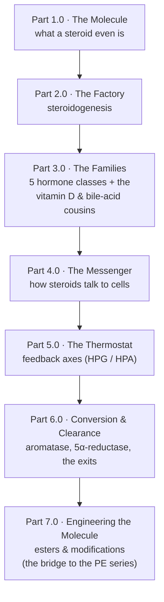

> [!abstract] This is the hub for the **Hormonal Steroids** breakdown inside [[I'm Just Curious — Series Hub|I'm Just Curious]]. It is the *science* layer: what these molecules are, where the body makes them, how they signal, and why they shape-shift into one another. It is deliberately **not** a protocol. The applied side (cycling, monitoring, protection, coming off) lives in the [[Part 1.0 - The Decision|Performance Enhancement]] series and stays there.

## Why I went down this hole

I'd already written the whole applied stack on performance enhancement: when to cross the line, how to monitor, how to design a cycle, how to protect yourself, how to come off. All of it practical. All of it "do this, watch that."

And the whole time, one question kept nagging: *what is a steroid, actually?* Not what it does in a gym. What it **is**. Why does the same word cover the cortisone shot a doctor puts in your shoulder, the testosterone a bodybuilder injects, the estrogen in a birth control pill, the cholesterol your GP frowns at, and the vitamin D you get from the sun? That can't be a coincidence. It isn't.

This series is me answering that question from the bottom up, in the spirit of the lineage-and-mechanism breakdowns Derek does over at More Plates More Dates, but pointed purely at understanding rather than application.[^mpmd]

## The arc

The plan is seven parts, each one floor deeper than the last. We start with the molecule, work through how the body builds, uses, and disposes of it, and end with how humans re-engineer it.

- **Part 1.0 (built) — [[Part 1.0 - What a Steroid Hormone Actually Is|What a Steroid Hormone Actually Is]].** One skeleton, many costumes: the four-ring sterane backbone (with its carbon numbering and the five named carbon-class skeletons), cholesterol as the parent of all of them, what makes a steroid a *hormone*, and why being fat-soluble rewrites every rule.
- **Part 2.0 (built) — [[Part 2.0 - The Factory|The Factory: Steroidogenesis]].** How the body builds these molecules from cholesterol, the rate-limiting gate (StAR), the master intermediate (pregnenolone), the enzyme switch (CYP17A1) that decides cortisol versus androgens, and why a single missing enzyme reroutes the whole tree.
- **Part 3.0 — The Families.** The five hormone classes (androgens, estrogens, progestogens, glucocorticoids, mineralocorticoids) and what each is *for*, plus an honest section on the two non-hormone cousins built from the same parent: vitamin D and the bile acids.
- **Part 4.0 — The Messenger Mechanism.** Why a fat-soluble molecule travels on carrier proteins, slips through the cell membrane, and gives its orders by switching genes on and off (the genomic pathway), plus the faster non-genomic story.
- **Part 5.0 — The Thermostat.** The HPG and HPA feedback axes: why the body that makes these hormones also spends enormous effort throttling them, and what happens when the thermostat gets overridden.
- **Part 6.0 — Conversion and Clearance.** Aromatase, 5-alpha-reductase, and the metabolic exits: why testosterone won't stay testosterone, the full conversion web, and where it all eventually goes.
- **Part 7.0 — Engineering the Molecule.** The bridge to the applied world: how humans modify the parent molecules and *why* (esters for half-life, 17α-alkylation to survive the liver, 19-nor and 7α-methyl to change aromatization and receptor behaviour). Still curiosity-side: the logic of the tweaks, not a protocol.

## What this series is not

> [!danger] Read this before anything else
> This is curiosity-driven biochemistry, not medical or pharmacological advice. I name molecules and describe mechanisms for understanding only. There are **no doses, no protocols, and no sourcing** anywhere in this series by design. Anabolic-androgenic steroids are prescription-only or outright illegal without a prescription in most jurisdictions, Malaysia included, and carry real risk. If you want the responsible applied treatment, that is exactly what the [[Part 1.0 - The Decision|Performance Enhancement]] series is for. Here, we're just figuring out how the machine works.

---

[^mpmd]: The lineage-and-mechanism style this series borrows from is most cleanly developed by Derek of More Plates More Dates (https://moreplatesmoredates.com), whose "Anabolic Steroid Family Tree" framework also underpins the applied [[Part 3.1 - The Anabolic Steroid Family Tree|Performance Enhancement series]]. The science here is drawn from standard endocrinology and biochemistry references, cited per article.
