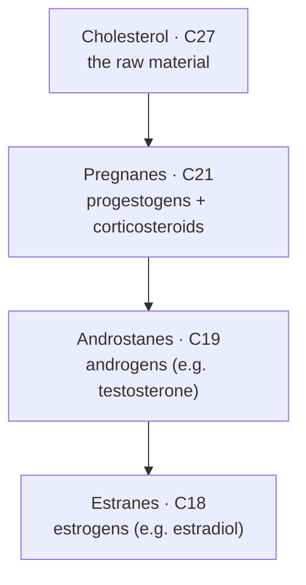

> [!abstract] This is **Part 1.0 of 7** in the [[Hormonal Steroids — Series Hub|Hormonal Steroids]] breakdown inside [[I'm Just Curious — Series Hub|I'm Just Curious]]. It is the science layer beneath the applied [[Part 1.0 - The Decision|Performance Enhancement]] series, written purely to understand the thing. The path:
>
> - **Part 1.0 (this article):** What a Steroid Hormone Actually Is
> - **Part 2.0:** The Factory (steroidogenesis)
> - **Part 3.0:** The Families (+ the vitamin D & bile-acid cousins)
> - **Part 4.0:** The Messenger Mechanism
> - **Part 5.0:** The Thermostat (feedback axes)
> - **Part 6.0:** Conversion and Clearance
> - **Part 7.0:** Engineering the Molecule (esters & modifications)

> [!danger] Framing
> This is curiosity-driven biochemistry, not medical advice and not a protocol. No doses, no sourcing. If you want the responsible applied side, read the [[Part 1.0 - The Decision|Performance Enhancement]] series instead. Here, we're just opening the hood.

---
## Table of Contents

- [The most overloaded word in your medicine cabinet](#the-most-overloaded-word-in-your-medicine-cabinet)
- [One skeleton, many costumes](#one-skeleton-many-costumes)
- [Cholesterol is the parent, not the villain](#cholesterol-is-the-parent-not-the-villain)
- [What makes a steroid a *hormone*](#what-makes-a-steroid-a-hormone)
- [Why being fat-soluble rewrites every rule](#why-being-fat-soluble-rewrites-every-rule)
- [The carbon-count map: how 27 becomes 21, 19, 18](#the-carbon-count-map-how-27-becomes-21-19-18)
- [Why this is worth knowing](#why-this-is-worth-knowing)
- [Part 1.0 Takeaways](#part-10-takeaways)
- [Where this goes next](#where-this-goes-next)
- [Sources and references](#sources-and-references)

---
## The most overloaded word in your medicine cabinet

Here is the thing that started this whole series for me.

The word "steroid" shows up in five completely different conversations, and at first glance they have nothing to do with each other:

1. A doctor puts a **cortisone** shot in your inflamed shoulder. "It's a steroid," they say, "to bring the swelling down."
2. A bodybuilder injects **testosterone**. "He's on steroids."
3. A birth-control pill works because of **estrogen** and **progestin**. Steroids again.
4. Your GP frowns at your blood panel and warns you about **cholesterol**. A steroid (technically a sterol, which we'll get to).
5. You read that **vitamin D** is actually a hormone your skin makes from sunlight. Also, structurally, a steroid.

Anti-inflammatory, muscle-building, contraceptive, the thing clogging your arteries, the thing sunlight makes in your skin. How is that one word?

It turns out it is not a coincidence and it is not loose language. All five are members of the same molecular family, built on the exact same chemical skeleton, and (this is the part that genuinely surprised me) every single one of the hormones in that list is manufactured by your body out of that cholesterol you were told to fear. They are not cousins. They are closer than that. They are the same chassis wearing different costumes.

Once you see the chassis, the whole zoo of "steroids" stops being a list of unrelated things to memorise and becomes one structure with a handful of modifications. That is what this article is about: the chassis, where it comes from, and what turns it into a *hormone* specifically.

---
## One skeleton, many costumes

Every steroid you have ever heard of is built around a single core structure. Chemists call it **gonane** (or the sterane nucleus), and it is beautifully simple: seventeen carbon atoms locked into four fused rings.[^gonane]

Three of those rings are six-membered (carbon hexagons, labelled A, B and C), and one is five-membered (a pentagon, ring D). They are *fused*, meaning they share edges, so the whole thing is rigid and flat-ish, like four interlocking honeycomb cells stamped out of one sheet.

> [!note] The core, in one sentence
> A steroid is any molecule built on the gonane skeleton: **17 carbons, four fused rings (three six-membered, one five-membered)**. Change what hangs off that skeleton, and you change everything the molecule does, without changing what it fundamentally *is*.

The chemists who map these molecules give every position a fixed address. The four rings are labelled **A, B, C and D** (the three hexagons then the pentagon), and the carbons are numbered **1 through 17** as you walk around the frame. Two extra carbons sit like tags sticking up off the ring junctions, the angular methyl groups numbered **C18 and C19**, and the side chain (when a molecule has one) extends from **C17**.

That numbering is not trivia, and it is worth holding onto, because the rest of this article keeps pointing at specific addresses. When I say later that estrogens "lose C19," I mean one of those two little methyl tags literally gets snapped off. When I say the side chain hangs from C17, that is the top corner of ring D. The entire family system, once you see it, is just "which numbered position got modified."

That rigid four-ring frame is the constant. What varies is almost cosmetic by comparison:

- which carbons carry an **oxygen** (a hydroxyl group, a ketone),
- whether a ring has a **double bond** in it or not,
- what **side chain** dangles off the top corner (carbon 17),
- and whether a stray methyl group is present or has been shaved off.

These look like trivial edits. They are not. Moving one oxygen or deleting one carbon is the difference between a molecule that builds muscle and one that does the opposite, between something that retains salt and something that suppresses your immune system. The skeleton is shared; the personality lives in the decorations. This is exactly why, later in the series, it will make sense that your body can turn one hormone into another with a single enzyme: it is not rebuilding the molecule, it is just changing the costume.

If you have read the applied [[Part 3.1 - The Anabolic Steroid Family Tree|family tree]] in the Performance Enhancement series, this is the deep reason that framework works at all. "Families" of steroids exist *because* they all share one skeleton and differ only in their decorations.

---
## Cholesterol is the parent, not the villain

We are trained to think of cholesterol as a problem. A number on a blood test. A thing to lower.

Structurally and biologically, cholesterol is the **raw material your body cannot make these hormones without**. Every steroid hormone in your body, without exception, is built from cholesterol.[^chol] Cortisol, testosterone, estrogen, progesterone, aldosterone, the lot. Take cholesterol away entirely and the entire endocrine steroid system has nothing to build from.

Cholesterol is itself a steroid (more precisely a *sterol*, a steroid with a hydroxyl group at one end and a long hydrocarbon tail at the other). It has the same four-ring gonane core, plus a tail. It has 27 carbons. And it is the parent molecule for a long list of essentials:

- the **steroid hormones** (the subject of this series),
- **bile acids** (which let you digest fat),
- **vitamin D** (made in your skin from a cholesterol relative when UV light hits it),
- and the **membranes of your cells** themselves, where cholesterol sits wedged between the fatty molecules and tunes how fluid the membrane is.

> [!tip] The reframe that stuck with me
> Cholesterol is not the villain of the story. It is the **lumber yard**. Your steroid hormones are what your body builds out of the lumber. Whether the supply is a problem is a circulation-and-quantity question (a cardiovascular one), not evidence that the molecule itself is bad. The same lumber builds the house and, in the wrong place and amount, blocks the driveway.

So the journey of the next article (the factory) is really the journey of cholesterol: 27 carbons walking into the assembly line and coming out the other side as a hormone, a few carbons lighter. Hold that image. It is the spine of the entire series.

---
## What makes a steroid a *hormone*

Cholesterol is a steroid but not a hormone. A bile acid is a steroid but not a hormone. So what is the extra thing that earns a molecule the word "hormone"?

A **hormone** is a signalling molecule: something one part of the body releases into the blood to deliver an instruction to another part of the body. The word comes from the Greek for "to set in motion," which is exactly the job. A hormone is a message in a bottle, dropped into your bloodstream, addressed to whichever cells happen to have the right receptor to read it.

So a **steroid hormone** is the intersection of two ideas:

- it is a **steroid** (built on the gonane skeleton, derived from cholesterol), and
- it is a **hormone** (made by an endocrine gland, released into the blood, and acting as a chemical instruction somewhere else).

The endocrine glands that specialise in this are a short list worth knowing up front, because the rest of the series keeps returning to them: the **adrenal glands** (sitting on top of your kidneys, making cortisol and aldosterone and a chunk of your androgen precursors), the **testes** (testosterone), the **ovaries** (estrogens and progesterone), and the **placenta** during pregnancy. Each is essentially a specialised cholesterol-processing plant, tooled with a slightly different set of enzymes so it pumps out a different end product.

> [!example] The two big hormone classes, and why steroids are the weird ones
> Most of your hormones fall into two structural camps. **Peptide and protein hormones** (insulin, growth hormone, most of the pituitary's output) are chains of amino acids: water-soluble, big, and unable to cross the greasy cell membrane, so they knock on the door from outside. **Steroid hormones** are small, fat-soluble lipids that walk straight *through* the door. That single difference (water-soluble vs fat-soluble) drives almost everything strange about how steroids behave, which is the next section.

---
## Why being fat-soluble rewrites every rule

This is the part where "it's made from cholesterol" stops being trivia and starts explaining behaviour.

Cholesterol is a fat. Anything built from it inherits that property: steroid hormones are **lipophilic** (fat-loving) and **hydrophobic** (water-fearing). Your blood is mostly water. So a steroid hormone has a problem the moment it is released: it does not dissolve well in the very fluid that is supposed to carry it around.

That one fact cascades into a whole set of consequences that make steroid hormones behave nothing like their peptide cousins:

**They have to travel on carrier proteins.** Because they can't float freely in watery blood, most steroid hormone molecules ride bound to transport proteins (albumin, and specialised carriers like sex-hormone-binding globulin). Only the small unbound fraction is "free" and biologically active at any moment. This is why, in the applied world, people obsess over *free* testosterone and not just total testosterone: the bound majority is in transit, not on duty. We'll unpack that properly in Part 4.

**They pass straight through cell membranes.** A cell membrane is a fatty barrier, which is a wall to water-soluble hormones but an open door to fat-soluble ones. Steroid hormones simply diffuse through it and end up *inside* the target cell. Peptide hormones never get in; they have to shout through receptors on the surface. Steroids let themselves in.

**They give their orders to your DNA.** Once inside, a steroid hormone finds its receptor and the hormone-receptor pair travels to the cell nucleus, where it binds DNA and changes which genes get read. The hormone is not flipping a quick switch on the surface; it is reaching into the cell's instruction manual and editing what proteins the cell builds. (This is the "genomic" mechanism, and it is the heart of Part 4.0.)

**So their effects are slow but deep.** Because the pathway runs through gene expression and protein-building, steroid effects take hours to days to fully show up, and they linger. Compare that to adrenaline (a non-steroid), which slams into surface receptors and changes your heart rate in seconds. Steroids are not the sprinters of the hormone world. They are the ones that quietly rewrite the blueprint.

**They can't be stored in advance.** Peptide hormones get packaged into vesicles and stockpiled, ready to dump on demand. Steroid hormones are made on demand and released as they're produced, more or less as fast as the gland can build them from cholesterol. There is no warehouse of pre-made testosterone waiting to be released. This is why steroid output is governed by *production* rate, which is in turn governed by the feedback thermostat of Part 5.0.

> [!summary] The chain of consequences
> Built from cholesterol → fat-soluble → can't dissolve in blood (so it travels bound to carrier proteins) → slips through the cell membrane (so its receptor is *inside* the cell) → acts on DNA (so its effects are slow, deep and lasting) → can't be pre-stored (so output is set by production rate, not release). Almost every quirk of steroid hormones falls out of that first link.

---
## The carbon-count map: how 27 becomes 21, 19, 18

Here is the elegant bit that ties the structure back to the families you actually care about.

Remember cholesterol has 27 carbons. As the body processes it toward the various hormone classes, it shaves carbons off in steps. Each resulting size has a formal skeleton name, and lining them up by carbon count puts the whole cholesterol family on one shelf:

> [!example] The five named skeletons (chassis by size)
> - **Cholestane (C27):** cholesterol's own skeleton, the full molecule with its long tail intact.
> - **Cholane (C24):** the bile-acid skeleton (the tail trimmed but not gone). Not a hormone, but a cousin we'll properly meet in Part 3.0.
> - **Pregnane (C21):** the progestogens and the corticosteroids.
> - **Androstane (C19):** the androgens.
> - **Estrane (C18):** the estrogens.
>
> Read it top to bottom and you are literally watching carbons get shaved off cholesterol, one cut at a time, until you reach the smallest, the estrogens.

The major classes of steroid *hormone* sort neatly by **how many carbons they have left**:[^carbon]

- **C21 (pregnanes):** twenty-one carbons. This group covers the **progestogens** (like progesterone) and the **corticosteroids** (glucocorticoids like cortisol, and mineralocorticoids like aldosterone). They sit closest to cholesterol, having lost the long tail but kept a short side chain.
- **C19 (androstanes):** nineteen carbons. This is the **androgen** family (testosterone, DHT, and relatives). Lose the side chain entirely and you drop into this group.
- **C18 (estranes):** eighteen carbons. The **estrogens** (estradiol and relatives). Delete one more carbon (the methyl group at position 19) and aromatise one of the rings, and an androgen becomes an estrogen.

Sit with that last arrow for a second, because it is the quiet bombshell of the whole topic: **the difference between testosterone (C19, the classic "male" hormone) and estradiol (C18, the classic "female" hormone) is one carbon and a tweaked ring.** They are essentially the same molecule with a tiny edit. The body makes estrogen *out of* testosterone using a single enzyme (aromatase). That is not a metaphor. It is a one-step chemical conversion, and it is why the male body always carries some estrogen and the female body always carries some testosterone.

> [!note] Why this matters more than it looks
> The "sexes have totally different hormones" picture is wrong at the molecular level. Everyone runs on the same small set of molecules differing by a carbon here and an oxygen there, in different *ratios*. That single idea (one carbon apart, converted by one enzyme) is the seed of half the interesting phenomena in endocrinology, and the entire reason Part 6.0 (conversion and clearance) exists.

---
## Why this is worth knowing

I said at the top that this folder has no job, and I meant it. But "no job" is not the same as "no payoff." Here is what understanding the chassis actually buys you, even if you never touch a syringe in your life.

It makes the world legible. When you next read that someone "aromatised too much" on a cycle, you won't need to take it on faith; you'll know they mean a C19 androgen lost a carbon and became a C18 estrogen, because that conversion is built into the machine. When a doctor says a cortisone shot is "a steroid," you'll know it shares a skeleton with testosterone and differs by a few oxygens, which is exactly why it has nothing to do with building muscle. When the cholesterol conversation comes up, you'll hold both truths at once: it is genuinely a cardiovascular risk factor in the wrong quantities, *and* it is the irreplaceable raw material for every hormone in this series.

And it does quietly feed the applied side. The [[Part 1.0 - The Decision|Performance Enhancement]] series tells you what to do and what to watch. This series tells you *why those rules exist*. Why free testosterone matters more than total. Why effects take weeks, not minutes. Why your body fights back when you flood it from outside (the thermostat, Part 5.0). Why one compound "converts" into another you didn't intend. None of that is arbitrary. It all falls out of "fat-soluble molecule, built from cholesterol, acting on DNA."

That is the whole pleasure of going one floor down. The rules stop being a list to memorise and start being things you could have predicted.

---
## Part 1.0 Takeaways

> [!summary] What to carry into Part 2.0
> - **"Steroid" is a structure, not a function.** Every steroid (the cortisone shot, testosterone, estrogen, cholesterol, vitamin D) is built on the same gonane skeleton: 17 carbons, four fused rings (three six-membered, one five-membered).
> - **Cholesterol is the parent of all of them.** Every steroid hormone your body makes is built from cholesterol (27 carbons). It is the lumber yard, not the villain.
> - **A steroid hormone = steroid + hormone:** built on the gonane core *and* released by an endocrine gland into the blood as a chemical instruction.
> - **Being fat-soluble rewrites the rules:** steroids travel bound to carrier proteins, slip through cell membranes, act on DNA inside the cell, produce slow and lasting effects, and can't be stored in advance.
> - **The classes sort by carbon count:** C21 (progestogens + corticosteroids), C19 (androgens), C18 (estrogens). Testosterone and estradiol are one carbon and one enzyme apart.

---
## Where this goes next

We have the molecule. We know it comes from cholesterol and we know why its fat-loving nature makes it behave the way it does. The obvious next question is the one Part 1.0 kept deferring: **how does the body actually build these things?**

[[Part 2.0 - The Factory|Part 2.0 — The Factory]] follows a single cholesterol molecule into the assembly line, through the enzyme relay that turns it into pregnenolone (the master intermediate), and out along the branching paths that lead to every class on the carbon-count map. That is where you see *why* a single missing enzyme can reroute a person's entire hormonal output, and how one organ becomes an estrogen factory while another becomes a cortisol factory using the same starting material.

---
## Sources and references

The biochemistry here is standard, settled endocrinology. The framing (lineage and mechanism over protocol) follows the spirit of Derek's More Plates More Dates breakdowns, which also underpin the applied [[Part 3.1 - The Anabolic Steroid Family Tree|Performance Enhancement]] series.

[^gonane]: Gonane (the sterane nucleus) is the core steroid structure: 17 carbon atoms in four fused rings, three six-membered and one five-membered. See *Gonane*, Wikipedia (https://en.wikipedia.org/wiki/Gonane) and *Steroid*, Wikipedia (https://en.wikipedia.org/wiki/Steroid).

[^chol]: Cholesterol is the precursor for all steroid hormones, as well as bile acids and vitamin D, and is a structural component of cell membranes. See "Sterols," Chemistry LibreTexts (https://chem.libretexts.org/Bookshelves/Introductory_Chemistry/Introduction_to_Organic_and_Biochemistry_(Malik)/06%3A_Lipids/6.07%3A_Sterols) and the Colorado State University steroidogenesis overview (https://vivo.colostate.edu/hbooks/pathphys/endocrine/basics/steroidogenesis.html).

[^carbon]: Steroid hormones classify by carbon number: pregnanes (C21, progestogens and corticosteroids), androstanes (C19, androgens), and estranes (C18, estrogens). See *Steroid*, Wikipedia (https://en.wikipedia.org/wiki/Steroid) and the steroidogenesis overview above.
