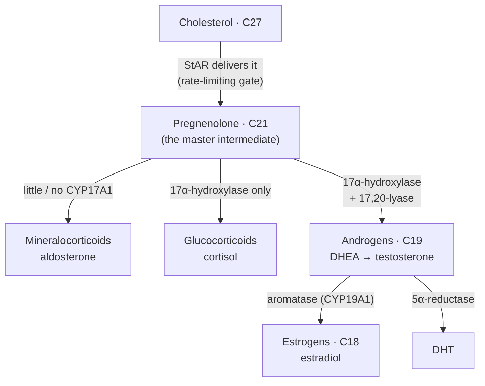

> [!abstract] This is **Part 2.0 of 7** in the [[Hormonal Steroids — Series Hub|Hormonal Steroids]] breakdown inside [[I'm Just Curious — Series Hub|I'm Just Curious]]. Part 1.0 covered *what* a steroid hormone is. This one covers where it comes from. The path:
>
> - **Part 1.0:** [[Part 1.0 - What a Steroid Hormone Actually Is|What a Steroid Hormone Actually Is]]
> - **Part 2.0 (this article):** The Factory (steroidogenesis)
> - **Part 3.0:** The Families (+ the vitamin D & bile-acid cousins)
> - **Part 4.0:** The Messenger Mechanism
> - **Part 5.0:** The Thermostat (feedback axes)
> - **Part 6.0:** Conversion and Clearance
> - **Part 7.0:** Engineering the Molecule (esters & modifications)

> [!danger] Framing
> Curiosity-driven biochemistry, not medical advice and not a protocol. No doses, no sourcing. The applied side lives in the [[Part 1.0 - The Decision|Performance Enhancement]] series. Here, we're following one cholesterol molecule down the assembly line.

---
## Table of Contents

- [One trunk, many branches](#one-trunk-many-branches)
- [The gate: getting cholesterol to the machine](#the-gate-getting-cholesterol-to-the-machine)
- [The first cut: cholesterol becomes pregnenolone](#the-first-cut-cholesterol-becomes-pregnenolone)
- [The switch that decides everything: CYP17A1](#the-switch-that-decides-everything-cyp17a1)
- [Two roads to testosterone](#two-roads-to-testosterone)
- [The branch map on one page](#the-branch-map-on-one-page)
- [Geography is destiny: why each organ makes a different thing](#geography-is-destiny-why-each-organ-makes-a-different-thing)
- [One missing tool reroutes the whole tree](#one-missing-tool-reroutes-the-whole-tree)
- [Why this is worth knowing](#why-this-is-worth-knowing)
- [Part 2.0 Takeaways](#part-20-takeaways)
- [Where this goes next](#where-this-goes-next)
- [Sources and references](#sources-and-references)

---
## One trunk, many branches

Part 1.0 ended on a quiet fact that turns out to drive this whole article: steroid hormones cannot be stockpiled. There is no warehouse of pre-made testosterone. Every molecule is built fresh, on demand, from cholesterol. So if you want to understand how much of a hormone you have, you have to understand the assembly line that makes it.

Here is the thing that genuinely surprised me when I drew it out: it is not a row of separate production lines, one per hormone. It is **one trunk that branches**. Every steroid hormone in your body, the cortisol and the testosterone and the estrogen and the aldosterone, starts from the same raw material (cholesterol) and passes through the same first checkpoint (a molecule called pregnenolone). Only *after* that shared beginning do the paths fork.

And what decides which fork a given cell takes is almost embarrassingly simple: **which enzymes that cell happens to own.** An enzyme is just a tool that performs one specific cut or addition. A cell stocked with one set of tools turns pregnenolone into cortisol. The same pregnenolone, in a cell with a different toolkit, becomes testosterone. The raw material is identical. The factory floor decides the product.

That single idea (same trunk, different tools, different branch) explains the entire layout of the steroid world, including why one organ is a "testosterone factory" and another is a "cortisol factory," and why a person born missing one tool can have their whole hormonal output rerouted. Let's walk the line from the top.

---
## The gate: getting cholesterol to the machine

The first surprise is that the slowest, most tightly controlled step in making a steroid hormone is not a chemical reaction at all. It is a *delivery problem*.

The enzyme that performs the first real cut lives on the inner membrane of the mitochondria (the cell's power plants). Cholesterol, the raw material, mostly sits elsewhere in the cell. Cholesterol is greasy and the gap it has to cross is watery, so it does not just drift over. It has to be actively ferried across, and the ferry is a protein called **StAR** (steroidogenic acute regulatory protein).[^star]

StAR shuttling cholesterol from the outer to the inner mitochondrial membrane is the **rate-limiting step** of the entire process.[^star] That is a precise and important claim: the bottleneck of steroid production is not "can the cell do the chemistry," it is "how fast can it get cholesterol to the machine." The chemistry downstream is fast. The ferry is the throttle.

> [!note] Why the bottleneck being *transport* matters
> If you want to dial steroid output up or down quickly, you do not rebuild the factory. You speed up or slow down the ferry. This is exactly the lever the body's control hormones pull: signals like LH (to the testes) and ACTH (to the adrenal glands) work largely by ramping up StAR activity, getting more cholesterol to the machine within minutes. Hold this thought, because it is the physical point where the feedback "thermostat" of Part 5.0 actually grips the system.

So before any molecule is cut or rearranged, there is a guarded gate, and the body keeps its hand on that gate.

---
## The first cut: cholesterol becomes pregnenolone

Once cholesterol is delivered, the first enzyme goes to work. It is called **CYP11A1** (you will also see it written as P450scc, where "scc" stands for side-chain cleavage), and it does exactly what that name says: it snips off a chunk of cholesterol's long tail.[^scc]

The product is **pregnenolone**. In carbon terms, cholesterol's 27 carbons drop to pregnenolone's 21 (the C27 cholestane skeleton becomes the C21 pregnane skeleton from Part 1.0). This is the first committed step of steroidogenesis, and it happens in every tissue that makes steroid hormones, without exception.[^scc]

I think of pregnenolone as **Grand Central Station**. Every steroid hormone passes through it. Cortisol, aldosterone, progesterone, DHEA, testosterone, estradiol: all of them are, in effect, pregnenolone that took a particular sequence of trains afterward. It is the single point through which the entire steroid economy flows.

From Grand Central, the very next decision sets the whole journey.

---
## The switch that decides everything: CYP17A1

If pregnenolone is the station, then one enzyme is the switch operator that decides which line you board. That enzyme is **CYP17A1**, and understanding it is the key that unlocks the whole branch map.[^cyp17]

CYP17A1 is unusual because it has *two* different jobs, and a cell can run it at zero, one, or both:[^cyp17]

- **17α-hydroxylase activity:** it adds a hydroxyl group at carbon 17.
- **17,20-lyase activity:** it then snips the remaining side chain off entirely (the cut that turns a C21 molecule into a C19 androgen).

Now watch how the level of CYP17A1 activity, all by itself, sorts the output into the three big branches:

- **No CYP17A1 at work → the mineralocorticoid branch.** With carbon 17 left untouched, pregnenolone flows toward **aldosterone** (the salt-and-water hormone). This is what happens in the outer zone of the adrenal cortex, which barely expresses CYP17A1 at all.
- **17α-hydroxylase only → the glucocorticoid branch.** Hydroxylate carbon 17 but stop there, and the path leads to **cortisol** (the stress hormone). This is the middle zone of the adrenal cortex.
- **17α-hydroxylase *and* 17,20-lyase → the sex-steroid branch.** Run both activities, cut the side chain off, and you drop into the **androgens** (and from there, the estrogens). This is the gonads and the inner adrenal zone.

> [!summary] The whole tree in one sentence
> How hard a cell runs **CYP17A1** decides whether pregnenolone becomes a mineralocorticoid (no C17 work), a glucocorticoid (hydroxylation only), or a sex steroid (hydroxylation plus side-chain cleavage). One enzyme, three destinies.

One more tool deserves a name here, because it appears on every branch: **3β-HSD** (3-beta-hydroxysteroid dehydrogenase). It performs the conversion that flips the "delta-5" forms into the "delta-4" forms (for example, pregnenolone into progesterone, and DHEA into androstenedione). You can think of 3β-HSD as the enzyme that "activates" a molecule into the more familiar, more active members of each class. The corticosteroid branches then finish with a couple of further hydroxylations (21-hydroxylase, then 11β-hydroxylase) to reach cortisol or aldosterone.

---
## Two roads to testosterone

Within the sex-steroid branch there is a small but famous detail: there are **two parallel routes** from pregnenolone down to testosterone, and they differ only in *when* the 3β-HSD step happens.[^cyp17]

- The **Δ5 ("delta-five") pathway:** pregnenolone → 17-OH-pregnenolone → DHEA → androstenediol → testosterone. (The 3β-HSD activation is saved for last.)
- The **Δ4 ("delta-four") pathway:** progesterone → 17-OH-progesterone → androstenedione → testosterone. (The 3β-HSD activation happens first.)

In humans, the Δ5 route is the preferred one for most androgen production. You do not need to memorise the intermediates. The point worth keeping is the shape of it: **the body often has more than one road to the same destination,** which is exactly why blocking a single step rarely shuts a hormone off completely (it just forces traffic onto the other road). We'll see the dramatic version of that in a moment.

---
## The branch map on one page

Here is the whole thing, stripped to its skeleton. Read it as "one trunk, then CYP17A1 picks the branch."

Two of those final arrows (aromatase and 5α-reductase) are the headline acts of Part 6.0, so I will only flag them here: once you have made an androgen, the body can still convert it onward into an estrogen or into DHT. The factory does not produce a finished, fixed product. It produces something that can keep changing. Hold that.

---
## Geography is destiny: why each organ makes a different thing

Now the idea from the very top pays off. If every steroidogenic cell shares the same trunk (cholesterol → pregnenolone), why does your adrenal gland make cortisol while your testes make testosterone?

Because **each tissue expresses a different toolkit of enzymes,** and the toolkit decides the branch. An organ is, in a real sense, *defined by which enzymes it bothers to switch on.*

- The **adrenal cortex** is the clearest case, because it is one gland split into three layers, each with a different toolkit:
    - the outer layer (zona glomerulosa) runs almost no CYP17A1, so it makes **aldosterone**;
    - the middle layer (zona fasciculata) runs 17α-hydroxylase, so it makes **cortisol**;
    - the inner layer (zona reticularis) runs the lyase activity too, so it makes **androgen precursors** like DHEA.
  Same gland, same pregnenolone, three different products, decided purely by which tools each layer expresses.
- The **testes** (specifically the Leydig cells) run the full sex-steroid toolkit and specialise in **testosterone**.
- The **ovaries** run the sex-steroid toolkit plus plenty of aromatase, so they produce **estrogens** and **progesterone** (in a cycle).
- The **placenta**, during pregnancy, is a fascinating special case: it is missing CYP17A1 almost entirely, so it cannot make androgens on its own and instead borrows precursors from the fetus to build estrogens. (A whole curiosity in itself, parked for now.)

> [!example] The reframe that made it click for me
> There is no separate "cortisol gene" or "testosterone organ" in the sense of a dedicated factory built from scratch. There is **one shared pathway**, installed everywhere, and then each tissue simply chooses which downstream tools to plug in. Specialisation is subtraction and selection, not reinvention. The body builds variety out of one machine by handing different departments different attachments.

---
## One missing tool reroutes the whole tree

If the branches are really just plumbing (one trunk, valves opened or closed by which enzymes are present), then a prediction follows: **take away one tool, and the pressure does not vanish. It backs up and finds another outlet.** That is not a hypothetical. It is one of the most common inherited endocrine conditions, and it is the cleanest proof that the tree behaves like plumbing.

The condition is **congenital adrenal hyperplasia (CAH)**, and the most common form comes from a deficiency in the enzyme **21-hydroxylase** (the CYP21A2 gene).[^cah] That enzyme sits on the corticosteroid branches, the steps needed to finish cortisol and aldosterone. Knock it out and the adrenal cortex cannot complete those products.

So what happens to all the precursor piling up behind the blockage? It cannot go forward toward cortisol, so it gets **shunted down the one branch that is still open: the androgen branch.**[^cah] The result is an excess of androgens, which can cause virilisation and other signs of hyperandrogenism. A defect in the cortisol pipe expresses itself as *too much testosterone-family output*, purely because that is where the backed-up pressure found a way through.

> [!note] Same logic, second example: the "backdoor"
> There is also a well-documented alternate route to DHT called the **androgen backdoor pathway**, where the body performs the 5α-reduction step *early* (on 17-OH-progesterone) and reaches DHT without ever passing through testosterone.[^cah] Both the front-door (via testosterone) and backdoor routes matter for normal male development. It is the same theme again: the destination (DHT) has more than one road, so the system is robust to a single blocked path.

This is why I find the factory view so satisfying. Once you see the layout as plumbing with valves, the diseases are not a list of unrelated syndromes to memorise. They are predictable consequences of closing a specific valve and asking where the pressure goes.

---
## Why this is worth knowing

Even purely for curiosity, the factory pays off in three ways.

It collapses a mess into a map. "Cortisol, aldosterone, testosterone, estrogen, progesterone, DHEA" stops being a vocabulary list and becomes one branching diagram you can redraw from memory: trunk, gate, master intermediate, the CYP17A1 switch, then the branches.

It explains the diseases without extra memorisation. CAH, certain forms of high blood pressure, patterns of hyperandrogenism: a lot of endocrine pathology is just "this valve is stuck, so pressure rerouted here." The map predicts the symptom.

And it quietly sets up the applied world. When the [[Part 1.0 - The Decision|Performance Enhancement]] series talks about suppression (your own testosterone production shutting down when you add hormones from outside), the *place* that shutdown physically happens is the gate we met at the top: the signal to run StAR gets switched off, the ferry slows, and the line goes quiet. The factory is where the thermostat of Part 5.0 reaches in and turns the dial.

That is the whole pleasure again: the rules were never arbitrary. They are what a branching, valve-controlled, single-trunk factory has to do.

---
## Part 2.0 Takeaways

> [!summary] What to carry into Part 3.0
> - **Steroids are built on demand, never stockpiled,** so output is set by the production line, not by release.
> - **It is one trunk, not many lines.** Everything starts from cholesterol and passes through one master intermediate, **pregnenolone**.
> - **The slowest, most controlled step is transport, not chemistry:** **StAR** ferrying cholesterol into the mitochondria is the rate-limiting gate, and it is the lever the body's control hormones pull.
> - **CYP11A1 (P450scc)** makes the first cut (cholesterol → pregnenolone, C27 → C21).
> - **CYP17A1 is the master switch:** none of it → mineralocorticoids (aldosterone); 17α-hydroxylase only → glucocorticoids (cortisol); hydroxylase plus 17,20-lyase → sex steroids (androgens, then estrogens).
> - **Geography is destiny:** each tissue makes a different hormone purely because it expresses a different enzyme toolkit (the three adrenal zones are the clearest demonstration).
> - **Block one enzyme and the pressure reroutes** (CAH from 21-hydroxylase deficiency shunts precursors into androgens). The tree behaves like plumbing.

---
## Where this goes next

We now have the assembly line and we know the branches end in distinct products. [[Part 3.0 - The Families|Part 3.0 — The Families]] walks each branch's endpoint and asks the next obvious question: what is each class actually *for*? Androgens, estrogens, progestogens, glucocorticoids and mineralocorticoids each get their job description, and then we follow the two non-hormone branches off the same trunk that kept showing up in the reference diagrams: **vitamin D** and the **bile acids**, the cousins built from the same parent that do completely different work.

---
## Sources and references

Standard endocrinology and biochemistry. The framing follows the lineage-and-mechanism spirit of Derek's More Plates More Dates breakdowns, which also underpin the applied [[Part 3.1 - The Anabolic Steroid Family Tree|Performance Enhancement]] series.

[^star]: StAR (steroidogenic acute regulatory protein) mediates cholesterol transfer from the outer to the inner mitochondrial membrane and is the rate-limiting step of steroid hormone production. See *Steroidogenic acute regulatory protein*, Wikipedia (https://en.wikipedia.org/wiki/Steroidogenic_acute_regulatory_protein) and *STAR (gene)*, Wikipedia (https://en.wikipedia.org/wiki/STAR_(gene)).

[^scc]: CYP11A1 (P450scc, cholesterol side-chain cleavage enzyme) catalyses the conversion of cholesterol to pregnenolone, the first reaction of steroidogenesis in all steroid-producing tissues. See *Cholesterol side-chain cleavage enzyme*, Wikipedia (https://en.wikipedia.org/wiki/Cholesterol_side-chain_cleavage_enzyme).

[^cyp17]: CYP17A1 has both 17α-hydroxylase activity (acting on pregnenolone and progesterone) and 17,20-lyase activity (splitting the side chain off 17α-hydroxypregnenolone and 17α-hydroxyprogesterone), and is central to both the Δ5 and Δ4 pathways toward androgens. See *CYP17A1*, Wikipedia (https://en.wikipedia.org/wiki/CYP17A1).

[^cah]: In congenital adrenal hyperplasia due to 21-hydroxylase (CYP21A2) deficiency, impaired cortisol synthesis causes precursors to accumulate and be shunted toward androgen synthesis, producing hyperandrogenism. The androgen backdoor pathway provides an alternate route to DHT via 5α-reduction of 17α-hydroxyprogesterone. See *Congenital adrenal hyperplasia due to 21-hydroxylase deficiency*, Wikipedia (https://en.wikipedia.org/wiki/Congenital_adrenal_hyperplasia_due_to_21-hydroxylase_deficiency) and *Androgen backdoor pathway*, Wikipedia (https://en.wikipedia.org/wiki/Androgen_backdoor_pathway).
