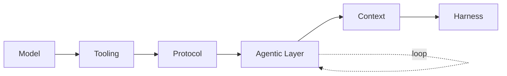

> [!abstract] This is **Part 7 of 7** in the Productivity Enhancement Series
>
> - **Part 1 — Foundation:** [[Part 1.0 - The Productivity Stack|The Productivity Stack]] · [[Part 1.1 - The Enemy of Productivity|The Enemy of Productivity]]
> - **Part 2 — The Physical Layer:** [[Part 2.0 - The Machine and the Room|The Machine and the Room]]
> - **Part 3 — The Workflow Engine:** [[Part 3.0 - The Workflow Engine|The Workflow Engine]] · [[Part 3.1 - The Self-Improving Workflow|The Self-Improving Workflow]]
> - **Part 4 — The Knowledge System:** [[Part 4.0 - PARA|PARA]] · [[Part 4.1 - Progressive Summarization|Progressive Summarisation]] · [[Part 4.2 - The Operating System|The Operating System]]
> - **Part 5 — The Tactical Toolkit:** [[Part 5.0 - The Tactical Toolkit|The Tactical Toolkit]]
> - **Part 6 — JIT Project Management:** [[Part 6.0 - Just-in-Time Project Management|Just-in-Time Project Management]]
> - **Part 7 — AI as a Worker (3 sub-articles):**
> 	- **Part 7.0 (this article):** [[Part 7.0 - The Agentic AI Framework|The Agentic AI Framework]] (the pipeline: Model → Tooling → Protocol → Agentic Layer → Context → Harness)
> 	- **Part 7.1:** [[Part 7.1 - From Chat to Continuous Worker|From Chat to Continuous Worker]] (the four levels of the harness)
> 	- **Part 7.2:** [[Part 7.2 - Persistent Memory|Persistent Memory]] (markdown files as the agent's long-term state)
> ----
## Table of Contents

- [Why the top of the stack is an agent](#why-the-top-of-the-stack-is-an-agent)
- [The pipeline](#the-pipeline)
- [Model: the foundation](#model-the-foundation)
- [Tooling: words become actions](#tooling-words-become-actions)
- [Protocol: how the model talks to tools](#protocol-how-the-model-talks-to-tools)
- [Agentic Layer: the loop](#agentic-layer-the-loop)
- [Context: better decisions each pass](#context-better-decisions-each-pass)
- [Harness: where it all runs](#harness-where-it-all-runs)
- [Part 7 Takeaways](#part-7-takeaways)
- [Your Agentic AI Task List](#your-agentic-ai-task-list)
- [Sources & references](#sources--references)

---

> [!important] Why the top of the stack is an agent
> Everything below this layer made *you* more productive. This layer makes a *worker* productive on your behalf. But the same warning as [[Part 1.0 - The Productivity Stack|Part 1.0]] applies hardest here: ==an agent on top of chaos just produces chaos faster.== You hand an agent a [[Part 6.0 - Just-in-Time Project Management|process]] that's already solid, documented in [[Part 3.1 - The Self-Improving Workflow|instructions]], and pointed at organised [[Part 4.0 - PARA|knowledge]]. This article is the mental model for *what an AI agent actually is*: a pipeline of six stages. Understand the pipeline and the whole "AI agent" buzzword collapses into something concrete you can reason about.

---
## The pipeline

An agent isn't one thing; it's a chain. Each stage adds one capability the stage before it lacked, and together they turn a text generator into a worker.

==Read it as a sentence: a **model** is given **tools**, reached through a **protocol**, run in a **loop** (the agentic layer), fed **context** each pass, all hosted inside a **harness**.== That sentence describes how advanced assistants operate today. Now each stage.

---
## Model: the foundation

The foundation is the **LLM**: the large language model. On its own it does one thing, predict text, and that sounds limited until you notice the move that changes everything: ==text can *be* action.== "Send the email," written as a structured instruction, is just text, but text that a piece of code can read and execute. So the model's words become the trigger for things happening in the world. The model is the brain; everything after it is how the brain reaches its hands.

---
## Tooling: words become actions

A brain with no hands is a commentator. **Tooling** (often called **function calling**) gives the model the ability to *execute specific functions*: search the web, read a file, query a database, send a message. You define a set of tools, and the model can choose to call one and use the result.

This is the [[Part 4.2 - The Operating System|Operating System]] idea pointed at the agent: the tools you'd build for yourself (the supplement forecaster, the calendar, the email triage) become the tools the agent can operate. ==The model decides *what* to do; the tools are *how* it actually does it.==

---
## Protocol: how the model talks to tools

To call a tool, the model and the tool need a shared language: a standardised way to say "here's the function, here are the arguments, here's the result." That standard is a **protocol**. This is exactly where **MCP (the Model Context Protocol)** fits: it standardises how models connect to external tools and data, so any tool that speaks MCP can be plugged into any model that speaks MCP.[^mcp]

The reason a protocol matters is the same reason USB mattered: ==without a standard, every tool needs a custom integration; with one, tools become plug-and-play.== This is what turned "AI that can use one or two hard-coded tools" into "AI you can connect to your whole stack."

---
## Agentic Layer: the loop

Here's the stage that earns the word *agentic*. A single tool call is not an agent; it's a one-shot. An agent runs in a **loop**:

> [!check] The agentic loop
> **Run** (take an action) → **Evaluate** (did it work? what came back?) → **Observe / adjust** (decide the next action) → run again.

The model acts, looks at the result, and decides what to do next, repeatedly, until the task is done. ==This continuous feedback loop is the whole difference between a chatbot that answers once and an agent that works a task to completion.== It's the same shape as the [[Part 3.0 - The Workflow Engine|Execute]] step in your own workflow (do, check, adjust), just running automatically. The loop is why an agent can handle a multi-step job: it doesn't need the whole plan up front, it figures out the next move from the last result.

---
## Context: better decisions each pass

A loop running blind makes poor choices. The fix is **context**: dynamic information injected into the model *between* loop iterations so each decision is better-informed. The current state of the task, the relevant files, what happened last step, your standing preferences.

This is the payoff of [[Part 3.1 - The Self-Improving Workflow|the self-improving workflow]] from Part 3, scaled up. Your `skills.md` and project instructions *are* context. Your [[Part 4.0 - PARA|PARA]] knowledge and [[Part 4.1 - Progressive Summarization|maps]], reachable via RAG, *are* context. ==The better the context you've built in the lower layers, the better every decision the agent makes.== Most of the difference between an agent that's useful and one that's useless is not the model; it's the quality of context it's given. This is why the whole series came before this article.

---
## Harness: where it all runs

The five stages above describe an agent's *anatomy*. The **harness** is its *body and home*: the runtime environment that hosts the pipeline, holds its files, gives it compute, and lets you start, schedule, and manage its work. A chat window is the smallest possible harness. A dedicated computer or VPS running an agent 24/7 is the largest.

==The harness is the difference between an agent you *talk to* and an agent that *lives somewhere and works*.== Systems that host agentic workflows (whatever the brand) are all, underneath, a harness wrapping this pipeline. That spectrum, from a chat box to a full always-on machine, is important enough to get its own article: [[Part 7.1 - From Chat to Continuous Worker|Part 7.1]].

---
> [!check] Part 7 Takeaways
> - An "AI agent" is not one thing; it's a **pipeline**: Model → Tooling → Protocol → Agentic Layer → Context → Harness.
> - **Model:** an LLM whose text *becomes action*. **Tooling:** the functions it can execute, your [[Part 4.2 - The Operating System|OS tools]] handed to the agent.
> - **Protocol** (e.g. **MCP**) is the standard language between model and tools, turning custom integrations into plug-and-play.
> - **Agentic Layer** is the **loop** (run → evaluate → adjust), the thing that makes it an agent and not a one-shot chatbot.
> - **Context** injected each pass is where your [[Part 3.1 - The Self-Improving Workflow|instructions]] and [[Part 4.0 - PARA|knowledge]] pay off. ==Most of an agent's quality is context quality, not model choice.==
> - The **Harness** is where it runs, from a chat box to an always-on machine ([[Part 7.1 - From Chat to Continuous Worker|Part 7.1]]). And an agent on chaos just makes chaos faster, so build the lower layers first.

---
## Your Agentic AI Task List

> [!todo] This week
> - [ ] Name one repeatable process you'd hand to an agent. Check honestly that it's already documented and points at organised knowledge.
> - [ ] Connect one real tool to your assistant via a protocol (an MCP connector for your email, calendar, or files) and watch it run a tool call.
> - [ ] Give it a small multi-step task and watch the **loop**: run, check the result, decide the next step.
> - [ ] Improve its **context**: feed it the relevant instructions and knowledge, and notice the jump in decision quality.
> - [ ] Read [[Part 7.1 - From Chat to Continuous Worker|Part 7.1]] to decide which level of harness your task actually needs.

---
## Sources & references

[^mcp]: The Model Context Protocol (MCP), introduced by Anthropic in late 2024, is an open standard for connecting AI models to external tools and data sources, so a tool built once can be used by any MCP-compatible model. It occupies the "Protocol" stage of the pipeline: the standardised channel through which a model's tool calls reach real functions. Function calling / tool use is the underlying model capability the protocol coordinates.
