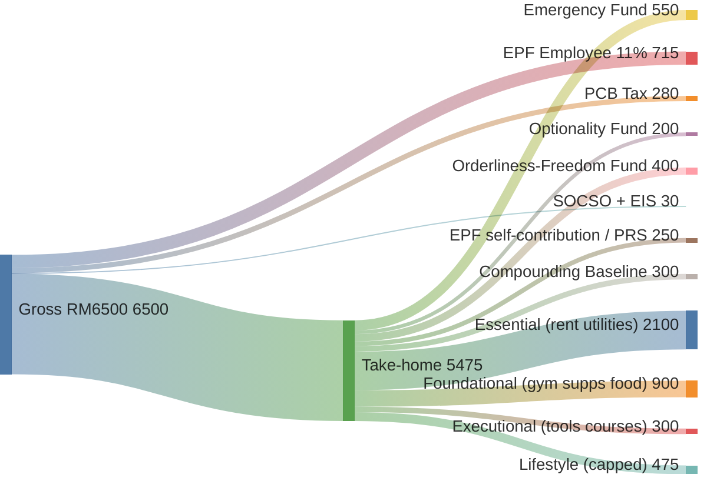

> [!abstract] This is **Part 1 of 6** in the Multiplying Money 101 series, the downstream hub of [[Part 1.0 - What Income Actually Is|Income 101]]. Where Income 101 teaches you how to *generate* income, this series teaches you what to *do* with it once it lands in your account: allocate, defend, multiply, and (the part most personal-finance content gets wrong) when to stop multiplying. The full path:
>
> - **Part 1 — Foundation (2 sub-articles):**
>   - **Part 1.0 (this article):** [[Part 1.0 - Allocation The Sankey Mindset|Allocation: The Sankey Mindset]] (visualise the flow, kill lifestyle creep)
>   - **Part 1.1:** [[Part 1.1 - The Five Buckets|The Five Buckets]] (one diagram for every pot of money you'll ever need)
> - **Part 2 — The Sequence:**
>   - **Part 2.0:** [[Part 2.0 - Order of Operations|Order of Operations]] (debt → emergency → tax relief → freedom → growth, in that order)
> - **Part 3 — The Benchmarks:**
>   - **Part 3.0:** [[Part 3.0 - On Par by Age|On Par by Age]] (Coast FI, EPF RIA tiers, inflation-adjusted freedom)
> - **Part 4 — Risk (2 sub-articles):**
>   - **Part 4.0:** [[Part 4.0 - The Risk Ladder|The Risk Ladder]] (which bucket lives on which rung)
>   - **Part 4.1:** [[Part 4.1 - High-Risk Plays|High-Risk Plays]] (houses, trading, businesses; not cafes)
> ----

## Table of Contents

- [Where this series sits](#where-this-series-sits)
- [The thesis: multiplication is not maximisation](#the-thesis-multiplication-is-not-maximisation)
- [The equation behind the series](#the-equation-behind-the-series)
- [The Sankey is the model](#the-sankey-is-the-model)
- [Three habits that hold the whole thing up](#three-habits-that-hold-the-whole-thing-up)
- [Live below your means, defined precisely](#live-below-your-means-defined-precisely)
- [Cash constraint is a good stressor](#cash-constraint-is-a-good-stressor)
- [Why a bigger paycheck without this discipline makes you more fragile](#why-a-bigger-paycheck-without-this-discipline-makes-you-more-fragile)
- [Part 1.0 takeaways](#part-10-takeaways)
- [Your baseline task list](#your-baseline-task-list)
- [Sources & references](#sources--references)

---

> [!important] Why start with allocation, not investing
> Almost every personal-finance article is fighting over the second question while ignoring the first. ==The number on your payslip doesn't matter if you don't know what happens to it the moment it arrives.== Two people on the same RM6,000 take-home end up in radically different freedom states based on what their money does in the 30 days after gaji. The Sankey diagram is not a chart; it's a mental model. Once you can see your own paycheck as a flow rather than a number, every downstream decision in this series (buckets, sequence, benchmarks, risk) gets easier.

---

## Where this series sits

The [[Part 1.0 - What Income Actually Is|Income 101]] series ended with an explicit handoff: once you've engineered your income engine (a job worth doing, an industry that's alive, the [[Part 4.0 - Stacking Economies and Designing Your Life|four economies]] stacked in the right order), the money has to *go somewhere*. This series is where it goes.

The companion piece in the Successful section, [[Financial Freedom Is a Coordinate, Not a Number|Financial Freedom Is a Coordinate]], is the philosophical spine. It argues that freedom is not a number but a *coordinate* on two axes: what you're protecting × how long you can protect it. ==Where the Coordinate piece is the framework, Multiplying Money 101 is the operating manual.== Same map, more roads.

Three through-lines carry into every article that follows:

- **Coverage beats totals.** A coordinate (what you're protecting × how long) beats a dollar number on a spreadsheet. The goal is not to be rich; the goal is to be unfuckable-with, which is a different objective.
- **Never blur safe money with risk money.** A 7% "high dividend" account is not your survival fund. Capital-preservation buckets and growth buckets live on different rungs of the risk ladder, and conflating them is the single most common way good intentions blow up. This fix runs through every part.
- **The 90/10 rule.** 90% of the result is the boring base (kill high-interest debt, build emergency, capture tax relief, hit "on par," let it compound). The 10% is the high-risk play (crypto, a business, a cashback house). Most readers invert this and wonder why nothing moves. Same rule as in the [[Part 4.0 - Pharmacology|Fit]] and [[Part 1.0 - What Nutrition Actually Is|Nutrition]] series; same answer.

> [!note] Standing disclaimer
> Specific MYR products, rates, and benchmarks are quoted across this series (GXBank, Boost, AEON, TNG GO+, EPF, PRS, KLCI ETFs). They change. Verify before deploying capital. Not financial advice.

---

## The thesis: multiplication is not maximisation

The bad habit most Malaysian personal-finance content has is conflating "invest as much as possible" with "be rich." That advice is wrong, and it's wrong in a way that costs the most when you're young, when ==time, not capital, is the rare asset==.

The pattern looks like this. Someone hits 25, gets a real job, sees a YouTube short about compound interest, and decides to throw every spare ringgit into a robo-advisor or a unit trust their cousin sells. ==They're not multiplying money. They're outsourcing it to a future that hasn't earned the right to it yet.== The optionality (the ability to take a sabbatical, start a business, buy a house in cash when the market drops, fund a peptide protocol, leave a job that's killing you) gets bled out one auto-debit at a time.

The thesis of this series is the opposite of "invest more." It is:

- Allocate deliberately, not by reflex.
- Build coverage on the layers that matter to *you* first.
- Hit your age-based benchmark for retirement and freedom (Part 3.0 will give you the actual numbers).
- *Then stop forcing it.* Reroute surplus into growth, life design, and calculated risk on your own terms.

You are not trying to die with the most money. You are trying to live with the most agency.

---

## The equation behind the series

An earlier draft of this material started with a half-formed equation that took two years of writing and tracking to clean up. Sharing the evolution, because it's the load-bearing logic of the entire series.

The first attempt (kept for honesty):

> `(Behavior(Income − Expenses) − Debt) − Surplus = Emergency Fund → Savings (Investment) = Optionality → Equity = Rich`

That was the right intuition, in the wrong order. The cleaner version, after running it against real Malaysian gaji cycles for two years:

> **Behavior × (Income − Expenses − Debt Service) = Surplus → Coverage → Optionality → Growth**

Every term matters:

- **Behavior** is the multiplier on the entire equation, not an afterthought. ==The same Income − Expenses with bad behavior produces zero surplus, no matter how big the gross number is.== This is why a RM30k/month earner can be broker than a RM6k/month earner. Discipline isn't a flavour; it's a coefficient. The whole equation is multiplied by zero if Behavior is zero, and the math doesn't care how tall the rest of the stack is.
- **Income − Expenses − Debt Service** is the arithmetic half. The leverage move is on *Expenses* and *Debt Service*, not on Income (which has a finite ceiling per role and per economy you're in; see [[Part 1.1 - The Four Attributes of a Good Job|Income 101 Part 1.1]] for why the income ceiling is real and bounded).
- **Surplus** is what's left at the end of the month *after* you've paid yourself and serviced your debts. If Surplus is consistently zero or negative, no investing advice in the world will help you. Surplus is the input to every downstream bucket.
- **Coverage** comes before Optionality. Coverage is your shield (the bucket you can fall back on for 6-12 months); Optionality is your hustle capital (the bucket you can take swings with). ==Most personal-finance advice skips Coverage and pushes you straight into Optionality, which is how people end up gambling with rent money.==
- **Growth** is last, not first. You don't graduate to Growth until Coverage is on par and Optionality has its own dedicated pool.

This series is a long-form unpacking of that one line. Part 1.0 (this article) is about the *first half* of the equation: Behavior, Income, Expenses, and the Surplus that falls out of them. Part 1.1 onward is about everything to the right of the arrow.

The intellectual lineage matters too, because none of this is original. The closest cousins are Naval Ravikant's *Algebra of Wealth* (the equation form), Scott Galloway's *The Algebra of Wealth* (the lifestyle-creep argument), and Bill Perkins' *Die With Zero* (the "stop over-investing, optionality matters" argument). The Coordinate piece borrows the Kelly Criterion split (Compounding Baseline vs. Innovation Fund) from Ed Thorp by way of Nick Maggiulli. Everything below stands on those shoulders.

---

## The Sankey is the model

A Sankey diagram shows flow. Inputs on the left, outputs on the right, thickness proportional to volume. The reason it's the right mental model for money (rather than a budget table, which is a static snapshot) is that ==money is a flow, not a stock==. A budget table tells you what you *planned*. A Sankey shows you what actually *happened*. The gap between the two is where every lesson in this series lives.

For a Malaysian salaried reader on a roughly RM6,500 gross, a real paycheck Sankey looks like this (numbers are illustrative, not prescriptive):

==Note==: the Innovation Fund row is zero on purpose. You don't fund the high-risk bucket until everything above it is on track.

(The source `.mermaid` file lives at `diagrams/sankey-paycheck-example.mermaid` for re-editing.)

Two things become visible the moment you draw this:

1. **The take-home is not "your money."** It's a *flow* with five or six legitimate destinations already pre-spoken-for. Treating it as a single pile waiting to be spent is the original sin of personal finance.
2. **The bottom (Innovation Fund) was left empty.** ==That's correct.== Part 1.1 (Five Buckets) and Part 2.0 (Order of Operations) explain when you turn that on.

If you've never drawn your own Sankey, that's task #1 at the bottom of this article. It takes 20 minutes and it will change what you do with your next paycheck.

---

## Three habits that hold the whole thing up

Drawing the Sankey once is a one-off insight. Running the equation month after month is a habit stack. Three habits are non-negotiable. Skipping any one of them turns the whole system into a Pinterest board.

**1. Budget (intent).** ==The budget is what you *plan* for your money to do.== It's a forecast, not a verdict. Build it once a month, at the start of the gaji cycle. Allocate every ringgit of expected take-home to one of the five buckets (Part 1.1) or to a category of Essential / Foundational / Executional / Lifestyle spending. Total has to balance to zero. This is the "intent" half of the data.

**2. Track (reality).** Track every transaction. Not "review your statement at month-end." ==Every transaction, captured the day it happens.== Tools that work in Malaysia: TNG eWallet for QR spend, your bank app (Maybank2u, CIMB Clicks, GX, Boost) for transfers and bills, GrabPay for delivery, and the occasional Excel row for cash. The format doesn't matter; the *consistency* does. Use a standardised header (date, amount, category, account, debit/credit). Negative for credit, positive for debit. One row per transaction. Done daily it takes two minutes. Done at month-end it's 90 minutes of forensic accounting and you'll get it wrong.

**3. Forecast vs. actual (the gap).** At the end of the month, compare what you *planned* (the budget) against what you *did* (the tracker). The gap is the data. Where did you overspend, on what category, on what frequency? Where did you *underspend* (which usually means you under-funded a bucket you said you cared about)? Where did you pay too much for something you could have got cheaper? Are you adding debt? Is debt growing because of interest somewhere you stopped looking at?

There's a useful question to attach to each gap row: ==*what happened here, brother?*== Not "how do I fix this," not "how do I cut," but *what actually happened*. Treat your own spending data like a witness. Be curious before you're prescriptive. The patterns will name themselves within two or three months.

This is the part the old draft was reaching toward (the data pipeline, the standardised columns, the question-driven analysis). It belongs here, in the first article, because ==without the habit, the rest of the series is theoretical==.

> [!tip] On tools
> You don't need a fancy app. A Google Sheet with five columns (date, amount, category, account, note) is sufficient and probably better than YNAB or Money Lover for the first six months, because it forces you to *see* your own data instead of letting an algorithm bucket it for you. Once the habit is locked in, graduate to whatever tool you want.

---

## Live below your means, defined precisely

"Live below your means" is the most-quoted, least-defined piece of advice in personal finance. It fails as instruction because *means* is undefined and *below* has no number attached. Both halves need fixing.

**Your *means* is not your take-home pay.** Your means is your *take-home minus your already-committed bucket contributions*. If your take-home is RM5,475 and you've pre-committed RM1,700 to Emergency, Optionality, Orderliness-Freedom, EPF, and Compounding Baseline (Part 1.1 names them properly), then your means for the month is RM3,775. That's the pool you live out of. Treating the full RM5,475 as "available" is how lifestyle creep starts.

**"Below" means actively cap your variable spending, not just hope it lands low.** A useful default: variable Lifestyle spending (eating out, entertainment, non-essential shopping) is capped at 10-15% of take-home, with a hard ceiling. Whatever the ceiling is, write it at the top of the month and treat any breach as Essential-spend (which means it triggers a Forecast vs. Actual review and a behaviour change next month).

Now the definition of lifestyle creep in concrete Malaysian terms, because every personal-finance article on the planet says "watch out for lifestyle creep" without telling you what it actually looks like:

- **Don't eat out daily just because you can afford it.** A RM25 lunch six days a week is RM7,800/year. Two of those lunches a week is RM2,600 and you still get the social time. Either is fine; the unconscious daily version is the problem.
- **Don't take on new recurring liabilities reflexively.** A new car loan, a phone instalment plan, a gym you don't actually go to, a streaming bundle that creeps from RM30 to RM120/month over two years. ==Every new recurring commitment is a tax on every future month, not just this one.== Add with a budget, not by impulse.
- **Don't auto-upgrade your living situation.** "I make more now, so I should move to a nicer place" is the most common, most expensive form of lifestyle creep in the Klang Valley. Rent is *the* largest single line item for most readers; doubling it because your salary doubled is a quiet way to halve your freedom.
- **Don't auto-replace a working phone (or laptop, or watch).** If it works, it keeps working until it doesn't. The marketing pressure to upgrade is engineered; it's not a real signal. A 3-4 year phone replacement cadence is fine. A 1-2 year cadence is lifestyle creep dressed up as productivity.
- **Don't buy convenience that erodes a skill.** Outsourcing your cooking to GrabFood permanently is not "buying time." It's renting helplessness at RM35/meal. The same arithmetic applies to laundry, errands, and increasingly to thinking (which is what subscribing to every AI tool without checking what you actually use is).

The textbook term for all of this is **lifestyle creep**. Worth naming, because once it has a name, you can see it.

---

## Cash constraint is a good stressor

A point from the older draft of this material that survived intact: ==cash constraint is a feature, not a bug==. Especially in your 20s, especially if your income trajectory is upward.

The instinct, when income rises, is to release the constraint. You earn more, you spend more, the constraint disappears, the stress drops. This *feels* like winning. It's not. The constraint was doing two jobs you stopped paying attention to:

- **It was forcing creativity.** Cooking instead of ordering; finding a free lifting program instead of paying for a coach; learning a thing instead of buying the course. Constraints make you good. Releasing them too early makes you soft in ways you don't notice until you need to be sharp again.
- **It was protecting your decision-making.** ==People who get suddenly rich make dumb decisions for the same reason lottery winners do.== The discipline that earned the first RM10k of surplus doesn't automatically scale to RM100k of surplus. Anyone who's watched a friend hit a windfall and torch it within twelve months has seen the pattern. Sudden upside without an upgraded operating system burns hot and fast.

The practical move is to ==treat each income increase as a *capability* upgrade, not a *lifestyle* upgrade==, for at least 6 months. Bonus came in? Route it to the next bucket on the order of operations (Part 2.0), not to a new car. Promotion? Increase your bucket contributions proportionally, not your monthly burn. Six months later, if a lifestyle upgrade still makes sense, take it deliberately, with a number attached. The constraint is not your enemy; the *unconscious* release of it is.

---

## Why a bigger paycheck without this discipline makes you more fragile

The clearest worked example of why allocation matters more than gross income.

Two readers on the same week in 2026:

- **Reader A** earns RM5,000 take-home, has pre-committed RM1,500 to buckets (Emergency, Optionality, Orderliness-Freedom, EPF, Baseline), lives in a RM1,200 room in PJ, runs a Foundational stack of RM700/month (gym, supplements, whole-food prep), and spends RM600 on the rest of life. They have 8 months of Essential + Foundational saved.
- **Reader B** earns RM12,000 take-home, has pre-committed RM800 to buckets (most of it new), lives in a RM4,500 condo near KLCC, runs a Foundational stack of RM900/month, and spends RM3,800 on the rest of life. They have 1.5 months of Essential + Foundational saved.

Reader B earns 2.4x what Reader A earns. Reader B is also more than 5x more fragile.

==If both readers get retrenched on the same Monday, Reader A has 8 months of runway on the layers they care about. Reader B has 6 weeks, and a RM4,500 condo lease they can't easily exit.==

This is the Coordinate point ([[Financial Freedom Is a Coordinate, Not a Number|cross-link]]) made arithmetically. Freedom is a coordinate (layer × runway), not a number. Reader A sits at `(Essential + Foundational, 8 months)`. Reader B sits at `(Essential + Foundational, 6 weeks)` despite earning more than twice as much. The gap is not income. ==The gap is allocation discipline, and that is the thing this series teaches.==

If you take one thing from Part 1.0, take this: **a bigger paycheck without an upgraded allocation system is a *downgrade* in optionality**. The system has to lead the income, not the other way around. This is the explicit handoff from [[Part 4.0 - Stacking Economies and Designing Your Life|Income 101 Part 4.0]]: the moment you start stacking economies (the Climb plus the Build plus the Catering Game), the temptation to upgrade lifestyle in lockstep gets stronger every month. The allocation system is the brake that lets you keep stacking without breaking.

---

## Part 1.0 takeaways

- ==Multiplication is not maximisation.== The goal isn't more money; it's more agency.
- The equation: **Behavior × (Income − Expenses − Debt Service) = Surplus → Coverage → Optionality → Growth**. Behavior is the multiplier, not a vibe. Zero behavior, zero surplus, no matter the gross.
- ==The Sankey is the model.== Money is a flow with pre-committed destinations, not a single pile waiting to be spent.
- Three habits hold the whole thing up: **budget** (intent), **track** (reality), **forecast vs. actual** (the gap that teaches you). Ask "what happened here, brother?" of every line.
- "Live below your means" only works once *means* is defined precisely (take-home minus pre-committed bucket contributions) and *below* has a number attached (cap variable Lifestyle at 10-15%).
- **Lifestyle creep** is the textbook term for the failure mode. Watch the five forms: daily eating out, new recurring liabilities, auto-rent-upgrade, auto-tech-replacement, convenience that erodes skill.
- Cash constraint is a feature. Treat each income increase as a *capability* upgrade for 6 months before any lifestyle move.
- Two readers on the same week: 2.4x income, 5x more fragile. ==Allocation discipline beats gross income for freedom==, and it's not close.

## Your baseline task list

Before Part 1.1 (the Five Buckets), do these three things. They are the minimum-viable allocation system.

1. **Draw your Sankey.** Pull your last full month of gaji and statements. Sketch the flow on paper, in a Google Sheet, or in a free tool like SankeyMATIC. Get every ringgit of take-home onto exactly one output line. ==If you can't account for more than 5% of your take-home, that's the work for next month.==
2. **Start a transaction log.** A five-column Google Sheet is enough (date, amount, category, account, note). Add to it daily for the next 30 days. Do not optimise it; just see the data.
3. **Define your *means*.** Take last month's take-home and subtract what you *should* have allocated to buckets (use the order-of-operations preview: Emergency, Optionality, Orderliness-Freedom, EPF self-contribution, Compounding Baseline). The number that's left is your actual means. Compare it to what you actually spent on variable Lifestyle. The difference is your starting point.

If those three feel obvious, good. ==Most personal-finance content skips them and proceeds straight to "which index fund should I buy."== That order is wrong. Allocation first, instruments later. Part 1.1 introduces the five buckets your Sankey is flowing into.

## Sources & references

- Naval Ravikant, *The Algebra of Wealth* — the equation form ([nav.al/wealth](https://nav.al/wealth)).
- Scott Galloway, *The Algebra of Wealth* (2024) — focus, stoicism, time, diversification framing, and the lifestyle-creep argument.
- Bill Perkins, *Die With Zero* (2020) — the "stop over-investing, optionality matters" thesis.
- Nick Maggiulli, *Just Keep Buying* (2022) — the Compounding Baseline argument; the case for boring index investing.
- [[Financial Freedom Is a Coordinate, Not a Number]] — the Coordinate framework, the four expense layers, the Kelly split between Compounding Baseline and Innovation Fund.
- [[Part 1.0 - What Income Actually Is|Income 101 — Part 1.0]] — income as a vote for optionality; the upstream half of this whole series.
- [[Part 4.0 - Stacking Economies and Designing Your Life|Income 101 — Part 4.0]] — the explicit handoff from income generation into the financial system.
- EPF, [Retirement Income Adequacy framework announcement](https://www.kwsp.gov.my/en/w/epf-releases-belanjawanku-2024-2025-and-retirement-income-adequacy-framework) (announced late 2024, effective 1 January 2026) — cited more heavily in Part 3.0.
- *Belanjawanku 2024/2025* (EPF Social Wellbeing Research Centre, Universiti Malaya) — Malaysian household expense benchmarks; single working-age adult in Klang Valley = RM1,970-2,800/mo. Cited more heavily in Part 3.0.
