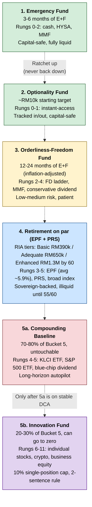

> [!abstract] This is **Part 2 of 6** in the Multiplying Money 101 series. [[Part 1.0 - Allocation The Sankey Mindset|Part 1.0]] drew the flow. This article names the destinations. Once you can see your money as a Sankey, the next question is: ==what are the legitimate pots it flows into, and in what order do they fill==. The answer is five, and only five. Anything labelled differently is either a sub-account of one of these or it shouldn't exist.
>
> Full series path:
>
> - **Part 1 — Foundation (2 sub-articles):**
>   - **Part 1.0:** [[Part 1.0 - Allocation The Sankey Mindset|Allocation: The Sankey Mindset]]
>   - **Part 1.1 (this article):** [[Part 1.1 - The Five Buckets|The Five Buckets]]
> - **Part 2 — The Sequence:**
>   - **Part 2.0:** [[Part 2.0 - Order of Operations|Order of Operations]]
> - **Part 3 — The Benchmarks:**
>   - **Part 3.0:** [[Part 3.0 - On Par by Age|On Par by Age]]
> - **Part 4 — Risk (2 sub-articles):**
>   - **Part 4.0:** [[Part 4.0 - The Risk Ladder|The Risk Ladder]]
>   - **Part 4.1:** [[Part 4.1 - High-Risk Plays|High-Risk Plays]]
> ----

## Table of Contents

- [Why the buckets need names](#why-the-buckets-need-names)
- [The five buckets at a glance](#the-five-buckets-at-a-glance)
- [Bucket 1: Emergency Fund (the shield)](#bucket-1-emergency-fund-the-shield)
- [Bucket 2: Optionality Fund (the hustle capital)](#bucket-2-optionality-fund-the-hustle-capital)
- [Bucket 3: Orderliness-Freedom Fund (the lean-FI pile)](#bucket-3-orderliness-freedom-fund-the-lean-fi-pile)
- [Bucket 4: Retirement / EPF on par](#bucket-4-retirement--epf-on-par)
- [Bucket 5: Growth and high-risk (split into two)](#bucket-5-growth-and-high-risk-split-into-two)
- [The Ratchet Rule](#the-ratchet-rule)
- [Never blur buckets](#never-blur-buckets)
- [Part 1.1 takeaways](#part-11-takeaways)
- [Your baseline task list](#your-baseline-task-list)
- [Sources & references](#sources--references)

---

> [!important] Why five
> Most personal-finance content gives you two buckets ("emergency fund" and "investment") or three at most. Reality has five. The bucket-conflation problem (when "emergency" and "freedom" and "opportunity" and "retirement" all collapse into one fuzzy pile) is the most common reason allocation systems quietly fail. ==Named, separated, and sized buckets prevent the most expensive mistake in personal finance: using survival money for a swing-for-the-fences bet because the buckets looked the same on a spreadsheet==.

---

## Why the buckets need names

In [[Part 1.0 - Allocation The Sankey Mindset|Part 1.0]], the Sankey ended with five or six destination lines. If those lines aren't named precisely, two failure modes start the moment the system meets real life.

The first failure mode is **bleed**. You "borrow" RM2,000 from your emergency fund to put into a stock tip from a friend, intending to replace it next month. Next month, something else comes up. Six months later, your emergency fund is half-full and you've forgotten how it got that way. The bucket *looked* like a single pile of "savings," so the boundary was easy to cross.

The second failure mode is **misallocation under stress**. You get retrenched. You panic. You pull money from the only labelled pile you have (whatever you call "savings") to cover three months of rent. That pile turns out to also have been doing three other jobs (retirement contribution, side-bet capital, freedom-fund seed). All four jobs now grind to a halt simultaneously. The stress didn't break one thing; it broke everything connected to one thing.

Both failure modes have the same fix: ==buckets need names, and the rules for each one have to be different==. When the names diverge ("Emergency Fund" vs. "Innovation Fund"), the discipline diverges with them. When the names are fuzzy ("savings"), the discipline collapses to the lowest standard.

The five buckets below are not arbitrary. Each one buys you a different *kind* of freedom, sits at a different *risk* level, and gets funded in a different *order*. Part 2.0 covers the order. This article covers the buckets themselves.

---

## The five buckets at a glance

Before going deep on each, the whole picture in one frame:

| # | Bucket | What it buys | Size | Risk profile | Instrument examples |
|---|---|---|---|---|---|
| 1 | **Emergency Fund** | Survival runway if income stops | 3-6 months of Essential + Foundational | Capital-safe, fully liquid | Bank current account, GXBank base savings, Boost base savings, MMF |
| 2 | **Optionality Fund** | Capital for swings and opportunities | ~RM10k starting target, scales with surplus | Capital-safe, fully liquid | TNG GO+, Versa Cash, KDI Save, separate GX pocket |
| 3 | **Orderliness-Freedom Fund** | 1-2 years of *everything* you care about without a paycheck | Your real annual E+F × 1-2 years, inflation-adjusted | Low-medium risk | FD ladder, MMF, conservative dividend / EPF |
| 4 | **Retirement (EPF on par)** | Long-horizon retirement coverage to RIA targets | RM390k / RM650k / RM1.3M by age 60 (RIA tiers) | Low risk (EPF is sovereign-backed) | EPF (employee + self-contribution), PRS |
| 5 | **Growth & High-Risk** | Compounded wealth and asymmetric upside | Everything that fits after 1-4 are on track | Mixed (split below) | Index ETFs, blue-chip dividend, REITs, individual stocks, crypto, business equity |

Bucket 5 splits into two sub-buckets that ==must never be blurred==:

- **5a. Compounding Baseline** — broad index, blue-chip dividend. Untouchable. Grows in the background.
- **5b. Innovation Fund** — the asymmetric stuff (individual stocks, crypto, options, a startup-style bet). Can go to zero without breaking anything else.

The full picture is the table above plus the Kelly split inside Bucket 5. Six labels total. Memorise them.

(Source: `diagrams/five-buckets.mermaid`.)

---

## Bucket 1: Emergency Fund (the shield)

**What it buys:** ==the right to keep your life running on the layers that matter, for 3-6 months, if your income stops tomorrow==. That includes Essential ([[Financial Freedom Is a Coordinate, Not a Number|the shield]]: rent, utilities, transport, insurance) *and* Foundational ([[Financial Freedom Is a Coordinate, Not a Number|the engine]]: gym, supplements, food, the work-on-yourself stack). It does not include Executional spending or Lifestyle. If income stops, those layers downshift.

**Sizing rule:** 3 months of E+F at the floor; 6 months once you've earned the right (Surplus is consistent, debt is at zero, and you've covered everything below in Part 2.0's order of operations). For a reader with RM2,500/month E+F, that's RM7,500-15,000.

**Risk profile:** capital-preservation. ==This bucket's job is to *be there*, not to grow.== Any rate above 0% is a bonus.

**Instrument examples (May 2026 Malaysian context; verify before deploying — rates move):**

- **GXBank base savings** ~2.00% p.a. (daily), fully liquid, no lock-in, PIDM-protected. The reliable choice for the "I need it tomorrow" portion.
- **Boost Bank base savings** ~2.50% p.a., daily, PIDM-protected. Same liquidity as GX. (Boost's headline "3.30%" applies only to Special Jars, not base.)
- **AEON Bank-i Savings Pot** ~3.00% p.a. (Shariah, variable profit rate), PIDM-protected. Note: the *main* AEON Savings-i account only pays ~0.88%; the 3.00% applies specifically to the labelled Savings Pot.
- **TNG GO+** ~3.0-3.4% p.a., instant access, RM20,000 cap. Useful for the portion you might genuinely need in 24 hours. ==Caveat: GO+ is a money-market fund (Principal e-Cash), not a PIDM-protected deposit.==
- **Money Market Funds (Versa Cash ~3.65%, KDI Save up to 4.00% EAR on the first RM50k, Stashaway Simple ~3.55% projected)** — 1-2 day withdrawal, no lock-in. Good for the bulk of the bucket. ==Caveat: all of these are funds, not PIDM-protected deposits.==

==Avoid bonus-pocket products with 3-6 month tenures for this bucket==, even if they pay 3.5-4%+. A tenure on your emergency fund means it's not an emergency fund; it's a fixed deposit pretending to be one. Use bonus pockets for Buckets 3 and 4, not 1. (The exception: GXBank's Bonus Pocket lets the *principal* stay liquid on early withdrawal — only the accrued bonus is forfeited — so a portion of Bucket 1 in a GX Bonus Pocket can work if you're disciplined about the boundary.)

**What this bucket is not:**

- Not investment capital.
- Not "freedom money" (that's Bucket 3, a different timeline and a different size).
- Not the place to "park" a windfall while you decide what to do with it. Windfalls go to whichever bucket is most under-funded per Part 2.0.

**The mental model:** Bucket 1 is the *boring* one. ==It's allowed to underperform inflation by 1-2% per year and still be doing its job, because its job isn't yield — its job is to exist on the morning your boss says "we need to talk."==

---

## Bucket 2: Optionality Fund (the hustle capital)

**What it buys:** the ability to act on an opportunity without raiding any other bucket. ==Stocks during a market drawdown, a domain you spotted, a paid pilot for a side project, a one-time discount on a course you'd actually use, a small position in an IPO==. This is the bucket that lets you *hustle without burning the floor*.

**Sizing rule:** a fixed starting target of around RM10,000 (scale up over time as Surplus grows). Track every in and out so you always know the replenish target. If you deploy RM4,000 from this bucket into a position, the bucket's *target* is still RM10,000; the next surplus refills it before anything else (per Part 2.0).

**Risk profile:** capital-safe and fully liquid *while it's sitting in the bucket*. Risk happens after the money leaves the bucket and enters a position. The bucket itself is held in cash-equivalents.

**Instrument examples:**

- A separate TNG GO+ pocket, labelled.
- A separate GXBank pocket without tenure.
- Versa Cash or KDI Save sub-account.

The label matters. ==If it's not labelled, it's not separated, and if it's not separated, it will quietly fund a GrabFood habit==.

**The honest part:** This is the bucket I've personally burned the most over the years. The optionality-hustle framing is real, but it has a failure mode: you start treating every Telegram crypto tip as "an opportunity," and the bucket empties faster than the underlying skill grows. Three guardrails that prevent this:

1. ==**Two-sentence rule.** If you can't explain the return mechanism of the bet in two sentences, the money does not move.== "It's going to moon" is one sentence and has no mechanism. "This REIT trades at 0.75x book with a 7% dividend, the rental market in this region has tightened, and management announced a buyback at 0.85x" is two sentences with a mechanism.
2. **Single-bet cap.** No single position larger than 20% of the Optionality Fund. A bad bet shouldn't crater the bucket.
3. **Pre-mortem.** Before deploying, write down two sentences: "I'd consider this bet a failure if X happens, and I'll exit at Y price or by Z date." Without this, you'll hold a losing position because the original reason has faded from memory.

These three rules also apply to Bucket 5b (Innovation Fund), which is the same discipline at larger scale. Worth practising at RM10k before doing it at RM100k.

**What this bucket is not:**

- Not an emergency fund (Bucket 1 is). Pulling from this bucket because you got retrenched is a category error.
- Not a freedom fund (Bucket 3 is). The Optionality Fund is small and active; the Freedom Fund is large and patient.
- Not "play money" in the casino sense. ==Optionality is the deliberate practice of betting on yourself; gambling is the absence of that discipline.==

---

## Bucket 3: Orderliness-Freedom Fund (the lean-FI pile)

This is the bucket the older drafts of this material kept reaching for and not quite naming. It deserves a section to itself.

**What it buys:** ==1-2 years of running everything Essential + Foundational without a paycheck==. Not 3 months (that's Bucket 1). A full year, ideally two. This is the bucket that turns a layoff from an existential event into an annoyance, and that lets you walk away from a job that's killing you without panic.

The name comes from the [Orderliness section](#) of the blog. Orderliness is the architecture of the things you do every day to stay functional and growing: the gym membership, the supplement stack, the routine blood work, the whole-food meal prep, the foundational pharmacology, the gear you actually use. ==This bucket secures all of that for the next 1-2 years, regardless of what happens to your job.==

**Sizing rule:** your real annual E+F spending × the years of coverage you want, inflation-adjusted at ~3-4% per year. For a reader at RM2,500/month E+F:

- 1 year of coverage = RM30,000 nominal, ~RM31,000 with 3% inflation hedged in.
- 2 years of coverage = RM60,000 nominal, ~RM63,500 with 3% inflation hedged in.

==Derive this number from your actual spending audit (the 30-day transaction log from Part 1.0), not from a guess.== If your audit says RM2,500/month, use RM2,500/month. If it says RM4,200/month, use RM4,200/month. Asserted numbers underfund readers by years. Audited numbers don't.

**Inflation rule:** protein grams are static; the ringgit price of protein is not. Malaysian general CPI runs ~2-3% historically; healthcare and food inflation run higher (~4-5% on multi-year horizons). Build the number with a 3-4% annual uplift assumption, and re-derive it once a year against your actual audit.

**Sanity check:** *Belanjawanku 2024/2025* (the EPF Social Wellbeing Research Centre's annual household budget guide) puts a single working-age adult in Klang Valley at **RM1,970/mo (public transport user)** or **RM2,800/mo (car owner)**. The RM2,690/mo figure often quoted is the *single elderly retiree* benchmark, used by EPF to anchor the RIA Adequate tier — not the working-age number. If your derived working-age E+F is well below the relevant RM1,970-2,800 line, your audit is missing items. Re-audit.

**Risk profile:** low-medium. This bucket is patient but not lazy. The whole point is that it can sit and compound at 4-6% while you don't touch it. Capital risk is acceptable as long as it's bounded; this is not the bucket for individual stocks or crypto.

**Instrument examples:**

- **FD ladder.** Three or six tranches with staggered maturities (3, 6, 9, 12 months) so a portion is always coming due. 3-3.8% p.a. typical in 2026 (Malaysian commercial banks).
- **MMF (Versa Cash ~3.65%, KDI Save up to 4.00% EAR on first RM50k, Stashaway Simple ~3.55%).** 1-2 day liquidity. Less yield ceiling than locked-up FDs, more flexibility. Not PIDM-protected (these are funds).
- **Bonus pockets with 3-6 month tenures.** Now they're useful, because this bucket can tolerate a 3-6 month lock-up. **GXBank Bonus Pocket 3.18% (3-mo) / 3.55% (6-mo)**, anniversary promo currently to 4.00% on 3-mo; **Boost Special Jars ~3.00%**; **Boost BoostUP Jar 4.00%** with RM500/mo spend condition + RM3k cap (verify the promo end-date).
- **EPF self-contribution as a long-horizon portion.** EPF Conventional declared **6.15% for 2025** (6.30% for 2024); the 5-year average sits at **~5.9%**. Some readers route a chunk of Bucket 3 into EPF for that return, accepting the liquidity tradeoff (withdrawable from age 55, fully from 60). This is a Bucket 3-meets-Bucket 4 hybrid; use cautiously.
- **Conservative dividend / REIT for the long-horizon portion.** Only after the FD/MMF base of 6 months is in place, and only the portion you don't expect to need in the next 12 months.

**What this bucket is not:**

- Not Bucket 1. Bucket 1 is the first 3-6 months of E+F. Bucket 3 is the *next* 12-24 months. They stack; they don't overlap.
- Not Bucket 4 (Retirement). Bucket 3 is for the next 1-2 years; Bucket 4 is for age 60+. Different timelines, different rules.
- Not Bucket 5. Bucket 3 is low-medium risk. The moment it goes into individual stocks or crypto, it stops being a Freedom Fund.

**The peace this bucket buys** is the qualitative core of the whole series. ==Once you can run your gym, your supplements, your food, your pharmacology, and your routine medical for the next 18-24 months without earning another ringgit, the question stops being "can I survive?" and starts being "what do I want to build?"== That shift is the actual deliverable of personal finance. Everything else is implementation detail.

---

## Bucket 4: Retirement / EPF on par

**What it buys:** ==coverage for the post-work decades, on a timeline you cannot earn your way out of==. You can replace a paycheck. You can rebuild an emergency fund. You cannot rewind ten years of compound interest.

**Sizing rule (effective 1 January 2026):** EPF's Retirement Income Adequacy (RIA) framework replaces the old "RM240k by age 55" Basic Savings benchmark with three tiers, all pegged to reference age 60:

- **Basic:** **RM390,000** by 60 (basic retirement needs; phasing in 2026-2028 from a 2026 interim of ~RM290k).
- **Adequate:** **RM650,000** by 60 (anchored to the Belanjawanku single-elderly figure: RM2,690/mo × 240 months).
- **Enhanced:** **RM1.3 million** by 60 (2x Adequate; meaningful retirement with travel, healthcare buffers, legacy capacity).

==Hit the tier that matches your post-work lifestyle target, not a tier higher and not a tier lower.== Going above Enhanced is over-investing if it comes at the cost of Buckets 1-3. Going below Basic is structurally underfunded retirement. Part 3.0 (On Par by Age) gives the year-by-year math.

**Risk profile:** low. EPF is sovereign-backed and has returned **5.2-6.9% over 2016-2025, averaging ~5.9%** (Conventional). Most recent declarations: 6.30% (2024), 6.15% (2025); Shariah converged with Conventional in 2024-2025 at the same rates. PRS (Private Retirement Scheme) is the optional second pillar, with a **RM3,000 annual tax relief** (extended through Year of Assessment 2030).

**Instrument examples:**

- **EPF employee contribution (11%)** — automatic, no decision required.
- **EPF self-contribution** — voluntary contributions on top of the statutory 11%, capped annually. Use this to accelerate toward the RIA tier.
- **PRS (Private Retirement Scheme)** — RM3,000 annual tax relief, separate from EPF. The relief is the headline; the underlying fund returns vary.

**What this bucket is not:**

- Not Bucket 3. Bucket 3 is for 1-2 years from now. Bucket 4 is for age 60+. ==The temptation to combine them ("EPF is my freedom fund") collapses the timeline and traps the freedom money behind a 60-year-old's withdrawal window.==
- Not the place to chase yield. EPF and PRS are boring on purpose. Boring is the feature.

---

## Bucket 5: Growth and high-risk (split into two)

The final bucket is where most personal-finance advice starts. ==It's also where most personal-finance failures live.== The fix is a structural split inside the bucket.

### Bucket 5a: Compounding Baseline

**What it buys:** long-horizon wealth on autopilot. Index investing, blue-chip dividend, the boring pile that grows in the background of your life.

**Sizing rule:** the larger half of Bucket 5. Default: 70-80% of Bucket 5 capital. This is what carries you in the long run.

**Risk profile:** medium. Equity index drawdowns of -20% to -40% are normal across a multi-decade horizon. ==The bucket survives them because you don't sell during them.==

**Instrument examples:**

- **KLCI ETF (e.g. MyETF MSCI Malaysia Islamic Dividend, FBM KLCI ETF).** Local market exposure.
- **S&P 500 / global index ETF (Versa Invest, Stashaway, Wahed)** for global diversification.
- **Blue-chip Malaysian dividend stocks** (banks, utilities, REITs) for the dividend portion.
- **EPF beyond RIA** if you've already hit Bucket 4 targets — surplus EPF self-contributions land here.

==The Compounding Baseline is *untouchable*.== That's the rule. It doesn't fund the Innovation Fund. It doesn't bail out a bad bet. It doesn't get raided for a house deposit. It grows.

### Bucket 5b: Innovation Fund

**What it buys:** the asymmetric upside. Individual stock picks, crypto positions, options, startup-style bets, the spicy stuff.

**Sizing rule:** the smaller half of Bucket 5. Default: 20-30% of Bucket 5 capital, capped in absolute terms by what you can lose without losing sleep. ==The whole fund must be able to go to zero without touching any other bucket==. If it can't, the cap is too high.

**Risk profile:** high variance. Drawdowns of -80% are normal here. Total loss is possible. ==This is the bucket where "play to win" is the operating mode==, and the reason you can play to win is that Buckets 1-4 and 5a are already covered.

**Discipline rules (same as Bucket 2, scaled up):**

1. Two-sentence return mechanism for every position.
2. Single-position cap of 10% of the Innovation Fund.
3. Written pre-mortem before deploying.
4. Time-bounded re-evaluation: if a position hasn't moved the needle in 18-24 months, exit.

Part 4.1 covers specific Innovation Fund plays (cashback houses, trading, businesses) in detail.

**The Kelly Criterion point** ([[Financial Freedom Is a Coordinate, Not a Number|cross-link]]): Bucket 5a + 5b together are the structural answer to the Kelly problem. ==Bet aggressively on 5b only because 5a is ring-fenced. Blur them and the system breaks==.

---

## The Ratchet Rule

Coverage is one-way. ==Once a bucket is filled, the next surplus moves *up* the stack, not back down==. This is the discipline that prevents the most common failure pattern (filling Bucket 1 to 3 months, dipping into it for an "investment," refilling to 2 months, dipping again, ratchet drifting backward over time).

The mechanic:

- **Forward only.** New surplus flows into whichever bucket is most under-funded relative to its target, working bottom-up (Bucket 1 first, then 2, then 3, then 4, then 5a, then 5b).
- **No bleed downward.** Money in a filled bucket does not get reallocated to a less-filled lower bucket. If Bucket 1 dips because of an actual emergency, refilling it is the *next* month's first job, ahead of every other bucket.
- **Re-derive once a year.** Inflation moves the targets. Re-audit your spending once a year (against Part 1.0's transaction log) and re-derive Buckets 1 and 3 targets. Adjust forward, not backward.

This rule is borrowed verbatim from the [[Financial Freedom Is a Coordinate, Not a Number|Coordinate piece]] and operationalised here.

---

## Never blur buckets

The single most expensive mistake in this whole framework is letting buckets blur together. Three concrete forms it takes:

1. **The "I'll borrow from emergency for this" trap.** A great opportunity comes up. You're a few thousand short. You "borrow" from Bucket 1 to take the position, fully intending to refill. Two things happen: (a) the position underperforms and you don't get the money back on the timeline you assumed; (b) life delivers an actual emergency in the next 18 months while Bucket 1 is short. ==This pattern is the most common single failure in real-world personal finance==. Fix: Bucket 1 is locked. Use Bucket 2 (Optionality) for opportunities; that's the bucket's job.
2. **The "EPF is my freedom fund" collapse.** Bucket 3 (Freedom) and Bucket 4 (Retirement) are at different timelines (1-2 years vs. age 60+). When you collapse them into one EPF pile, you've structurally trapped your freedom money behind a 35-year withdrawal window. You don't have a Freedom Fund; you have a Retirement Fund that you're hoping will also serve as freedom money. It won't.
3. **The "Compounding Baseline as opportunity capital" leak.** Bucket 5b (Innovation Fund) needs more cash for a position. The opportunity feels too good to skip. You "borrow" from 5a (Compounding Baseline) intending to repay. The position drops 60%. You now have less than you started with in both 5a and 5b, and the autopilot pile has been raided. ==This is the Kelly Criterion failure==. Fix: 5a is ring-fenced from 5b; the boundary is non-negotiable.

The rule of thumb that prevents all three: ==**bucket names are contracts**==. Once labelled, the money in that bucket can only do the job the label promised. Any other use is a breach of contract with your future self.

---

## Part 1.1 takeaways

- Five buckets, in order: Emergency → Optionality → Orderliness-Freedom → Retirement → Growth (split into Compounding Baseline + Innovation Fund).
- Each bucket buys a *different kind* of freedom on a *different timeline* at a *different risk level*. Conflating them is the root cause of most allocation failures.
- ==Bucket 1 (Emergency) is the *shield*; Bucket 3 (Freedom) is the *lean-FI pile*==. They stack; they don't overlap. 3-6 months vs. 1-2 years.
- Bucket 3's sizing is derived from your *audited* monthly E+F × 1-2 years, inflation-adjusted at 3-4%, sanity-checked against *Belanjawanku*.
- Bucket 4 (Retirement) is sized to EPF RIA tiers (Basic RM390k / Adequate RM650k / Enhanced RM900k+ by age 60). Hit your tier; don't over-shoot at the cost of Buckets 1-3.
- Bucket 5 splits into Compounding Baseline (untouchable autopilot, 70-80%) and Innovation Fund (asymmetric bets, 20-30%, can go to zero).
- **The Ratchet Rule:** new surplus flows up the stack, never back down. Bleed is the root failure mode.
- **Never blur buckets.** Bucket names are contracts. The three most common breaches: borrowing from Emergency for an opportunity, collapsing Freedom into EPF, raiding the Compounding Baseline for the Innovation Fund.

## Your baseline task list

1. **Label five accounts/sub-accounts in your banking app(s).** GX has labelled pockets; TNG has them; Versa and Stashaway let you create named portfolios. Label Bucket 1 "Emergency," Bucket 2 "Optionality," Bucket 3 "Freedom," and use EPF + PRS for Bucket 4, and a brokerage account (or robo-advisor) for Bucket 5a / 5b. ==If the labels aren't visible in the app, the discipline won't survive a stressful month.==
2. **Derive your Bucket 1 and Bucket 3 targets.** From your Part 1.0 transaction log, calculate monthly E+F. Multiply by 3-6 for Bucket 1 and by 12-24 for Bucket 3. Apply a 3-4% inflation uplift to Bucket 3. Write the numbers down somewhere you'll see them.
3. **Look up your EPF balance and your tier.** Log into i-Akaun. Note your current balance and your age. Part 3.0 will tell you the per-age target; for now, just see where you sit.
4. **Set the Optionality Fund target at RM10k (or your own number, sized to your comfort).** Don't fund it yet; the order of operations (Part 2.0) will tell you when. Just write down the target.

If you finish those four steps, you have a fully labelled five-bucket system, sized from real data, ready for Part 2.0 to tell you which one gets the next ringgit.

## Sources & references

- [[Part 1.0 - Allocation The Sankey Mindset|Multiplying Money 101 — Part 1.0]] — the equation and the Sankey upstream of this article.
- [[Financial Freedom Is a Coordinate, Not a Number]] — the four-layer expense framework (Essential / Foundational / Executional / Exponential), the Ratchet Rule, and the Kelly split underneath Bucket 5.
- EPF, [Retirement Income Adequacy framework (2026)](https://www.kwsp.gov.my/) — the Basic / Adequate / Enhanced tiers for Bucket 4.
- *Belanjawanku 2024-25* (EPF Social Wellbeing Research Centre, Universiti Malaya) — the household-budget benchmarks used as a sanity check on Bucket 3.
- Ed Thorp / William Poundstone, *Fortune's Formula* (2005) — the Kelly Criterion logic behind splitting Bucket 5 into a Compounding Baseline and an Innovation Fund.
- Nick Maggiulli, *Just Keep Buying* (2022) — the case for the Compounding Baseline (Bucket 5a).
