> [!abstract] This is **Part 5 of 6** in the Multiplying Money 101 series. The previous articles built the system: [[Part 1.0 - Allocation The Sankey Mindset|the flow]], [[Part 1.1 - The Five Buckets|the buckets]], [[Part 2.0 - Order of Operations|the sequence]], [[Part 3.0 - On Par by Age|the benchmarks]]. This article is the *single chart* that resolves the most expensive confusion in personal finance: ==which instrument belongs in which bucket==. The chart is a ladder; the rungs are returns; each bucket lives on a specific subset of rungs. Blur the rungs and the buckets blur with them.
>
> Full series path:
>
> - **Part 1 — Foundation (2 sub-articles):**
>   - **Part 1.0:** [[Part 1.0 - Allocation The Sankey Mindset|Allocation: The Sankey Mindset]]
>   - **Part 1.1:** [[Part 1.1 - The Five Buckets|The Five Buckets]]
> - **Part 2 — The Sequence:**
>   - **Part 2.0:** [[Part 2.0 - Order of Operations|Order of Operations]]
> - **Part 3 — The Benchmarks:**
>   - **Part 3.0:** [[Part 3.0 - On Par by Age|On Par by Age]]
> - **Part 4 — Risk (2 sub-articles):**
>   - **Part 4.0 (this article):** [[Part 4.0 - The Risk Ladder|The Risk Ladder]]
>   - **Part 4.1:** [[Part 4.1 - High-Risk Plays|High-Risk Plays]]
> ----

## Table of Contents

- [Why one ladder](#why-one-ladder)
- [The ladder, rung by rung](#the-ladder-rung-by-rung)
- [Where each bucket lives on the ladder](#where-each-bucket-lives-on-the-ladder)
- [Why 7%+ is not "safe"](#why-7-is-not-safe)
- [The time-axis: the S-curve frame](#the-time-axis-the-s-curve-frame)
- [Common ladder mistakes](#common-ladder-mistakes)
- [Part 4.0 takeaways](#part-40-takeaways)
- [Your baseline task list](#your-baseline-task-list)
- [Sources & references](#sources--references)

---

> [!important] The one structural fix the series has been building toward
> Almost every blow-up in retail personal finance comes from one structural error: ==putting safe-bucket money into risk-bucket instruments because the yields looked good==. A 7% dividend stock is *not* a 7% savings account. They are not interchangeable. Conflating them is how readers end up watching their "emergency fund" drop 30% in a 2022-style drawdown and being unable to use it for an emergency. The ladder below makes the boundary visible.

---

## Why one ladder

There are dozens of personal-finance instruments available to a Malaysian reader in 2026: savings accounts, fixed deposits, money market funds, EPF, PRS, REITs, dividend stocks, ETFs, unit trusts, robo-advisors, individual stocks, ASB (for eligible readers), gold, property, crypto, options, structured products. The list is bewildering, and the bewilderment is the reason most retail readers either freeze (do nothing) or pick wrong (chase yield).

A single risk ladder organises all of them. ==The ladder has two axes==:

- **Vertical (return).** Expected real return, long-horizon.
- **Implicit (volatility).** The size of the drawdowns you have to sit through to capture that return.

The fundamental finance lesson, compressed: ==return and volatility move together==. There is no such thing as "high return with no risk." Any instrument claiming otherwise is either (a) lying, (b) using a definition of "risk" that excludes the relevant failure modes, or (c) genuinely high-return for a structural reason that you are not the first to notice (which means it won't last).

The ladder is a reference card. Once you can place an instrument on the ladder, you know which bucket it belongs to. The bucket determines the rule.

---

## The ladder, rung by rung

Rough 2026 Malaysian-context returns. ==Verify before deploying capital==.

| Rung | Instruments | Expected return (annual) | Typical max drawdown | Liquidity |
|---|---|---|---|---|
| **0** | Current account, cash | 0-1% | None | Instant |
| **1** | High-yield savings (digital banks: GX/Boost base, AEON Savings Pot), MMF (Versa Cash ~3.65%, KDI Save up to 4% on first RM50k, Stashaway Simple ~3.55%) | 2-4% | None / cosmetic | Instant to 2 days |
| **2** | Fixed deposit (FD), bonus pockets with tenure (GXBank 3.18-3.55%, Boost Special Jars / BoostUP conditional 4%) | 3-3.8%, conditional pockets up to 4% | None (if held to maturity) | Lock-in 3-12 months |
| **3** | EPF, ASB (eligible), PRS conservative funds | EPF 5.2-6.9% over 2016-2025 (avg ~5.9%); most recent 6.30% (2024), 6.15% (2025) | None (EPF/ASB are sovereign-backed) | Restricted (EPF: 55/60; ASB: anytime) |
| **4** | KLCI ETF, REITs, blue-chip dividend stocks | 5-8% (with dividends) | -20% to -35% | T+2 settlement; price-volatile |
| **5** | Global index ETFs (S&P 500, MSCI World) | 6-10% nominal | -30% to -45% | T+2 settlement; price-volatile |
| **6** | Individual stocks (concentrated picks) | Wide variance | -50% to -80% | T+2; price-volatile |
| **7** | Property (rental cashflow + appreciation) | Variable, illiquid | Bimodal (region-dependent) | Months to liquidate |
| **8** | Crypto (BTC / ETH majors) | Wide variance | -70% to -85% | Instant but price-volatile |
| **9** | Crypto (altcoins, memes) | Lottery-distributed | -90% to -100% | Instant but price-volatile |
| **10** | Options, leveraged products | Lottery-distributed (skew negative) | -100% (with margin call possible) | Variable; mechanics-dependent |
| **11** | Business equity (own or angel-invested) | Bimodal (zero or many-multiple) | -100% common | Years to liquidate |

Visualised as a ladder (read bottom-up):

```mermaid
flowchart BT
    classDef safe fill:#d4edda,stroke:#155724,color:#000
    classDef low fill:#fff3cd,stroke:#856404,color:#000
    classDef medium fill:#cce5ff,stroke:#004085,color:#000
    classDef high fill:#f8d7da,stroke:#721c24,color:#000
    classDef lottery fill:#e2d3f0,stroke:#4b0082,color:#000

    R0["<b>Rung 0:</b> Cash / current account<br/>0-1% p.a. | no drawdown | instant"]:::safe
    R1["<b>Rung 1:</b> HYSA (digital banks, PIDM), MMF (funds, not PIDM)<br/>2-4% p.a. | no/cosmetic drawdown | instant to T+2"]:::safe
    R2["<b>Rung 2:</b> FD, bonus pockets with tenure<br/>3-3.8% (conditional pockets to 4%) | capital-safe if held | 3-12 mo lock-in"]:::safe
    R3["<b>Rung 3:</b> EPF, ASB (eligible), PRS conservative<br/>EPF 5.2-6.9% over decade (avg ~5.9%) | sovereign-backed | illiquid until 55/60"]:::low
    R4["<b>Rung 4:</b> KLCI ETF, REITs, blue-chip dividend stocks<br/>5-8% (with dividends) | drawdowns -20% to -35% | T+2"]:::medium
    R5["<b>Rung 5:</b> Global index ETFs (S&P 500, MSCI World)<br/>6-10% nominal | drawdowns -30% to -45% | T+2"]:::medium
    R6["<b>Rung 6:</b> Individual concentrated stocks<br/>Wide variance | drawdowns -50% to -80%"]:::high
    R7["<b>Rung 7:</b> Property (rental cashflow + appreciation)<br/>Variable, region-dependent | months to liquidate"]:::high
    R8["<b>Rung 8:</b> Crypto majors (BTC, ETH)<br/>Wide variance | drawdowns -70% to -85%"]:::lottery
    R9["<b>Rung 9:</b> Altcoins, memecoins<br/>Lottery-distributed | drawdowns -90% to -100%"]:::lottery
    R10["<b>Rung 10:</b> Options, leveraged products<br/>Negative skew | margin call possible"]:::lottery
    R11["<b>Rung 11:</b> Business equity (own or angel)<br/>Bimodal: zero or many-multiple | years to liquidate"]:::lottery

    R0 --> R1 --> R2 --> R3 --> R4 --> R5 --> R6 --> R7 --> R8 --> R9 --> R10 --> R11
```

(Source: `diagrams/risk-ladder.mermaid`.)

A few notes on the ladder:

- **Rungs 0-3 are *capital-preserved*.** Drawdowns are either nil or cosmetic (an MMF's NAV can dip 0.5% during a rate shock, then recover). The "return" you accept is low; the *capital* is reliably there. ==An important sub-distinction within Rung 1==: digital-bank savings accounts (GX, Boost, AEON Bank-i) are **PIDM-protected deposits** (covered up to RM250,000 per depositor per bank). Money-market funds (TNG GO+, Versa Cash, KDI Save, Stashaway Simple) are **funds**, not PIDM-protected. Both sit on Rung 1 for return-and-volatility purposes, but the deposit-vs-fund distinction matters for tail risk (issuer insolvency).
- **Rungs 4-5 are *long-horizon equity*.** They return 6-10% historically, but they do so *with* multi-year periods of negative returns. ==The drawdown is the price of the return==.
- **Rungs 6-11 are *high variance*.** Individual stocks, crypto, and business equity are not "investments" in the same sense as Rungs 0-5. They are *bets* with structural reasons to expect higher returns *and* much wider distributions of outcomes (including total loss).

The single most-important conceptual point: ==Rungs 4 and above can produce -30% to -100% in any 1-3 year window==. If you put money on Rung 4+ that you cannot afford to lose for 5+ years, you are mismatching the rung to the timeline.

---

## Where each bucket lives on the ladder

This is the bucket-to-rung mapping that resolves the whole series:

| Bucket | Job | Allowed rungs | Why |
|---|---|---|---|
| **1 — Emergency Fund** | Available tomorrow, capital-safe | Rungs 0-2 | Drawdown of any size makes Bucket 1 fail at its job |
| **2 — Optionality Fund** | Cash for swings | Rungs 0-1 | Capital must be liquid the day the opportunity appears |
| **3 — Orderliness-Freedom Fund** | 12-24 months of E+F | Rungs 2-4 (mostly 2-3; light 4 only on the long-horizon portion) | Patient but not gambling. EPF self-contribution allowed for long-horizon portion. |
| **4 — Retirement (EPF on par)** | Long-horizon retirement coverage | Rungs 3-5 (EPF, PRS, optional broad-index ETFs) | 30+ year horizon tolerates drawdowns |
| **5a — Compounding Baseline** | Autopilot growth, 30+ years | Rungs 4-5 (broad index, blue-chip dividend) | Long-horizon equity is the right tool |
| **5b — Innovation Fund** | Asymmetric upside | Rungs 6-11 | Can go to zero without breaking the system |

==This table is the answer to every "where should I put my money?" question==. Identify which bucket you're funding, then look at the allowed rungs.

**Worked example:**

A reader asks: "I have RM30,000 sitting in my savings account. I heard about a 7% dividend REIT. Should I move the money?"

The right answer depends on which bucket the RM30,000 belongs to:

- **If it's Bucket 1 (Emergency):** No. Rung 4. Wrong rung. Move it to Rung 1 (MMF) or Rung 2 (FD ladder) instead.
- **If it's Bucket 3 (Freedom), long-horizon portion:** Maybe. A REIT is a Rung 4 instrument. If this is the portion you don't expect to need in the next 24+ months, the rung is appropriate.
- **If it's Bucket 5a (Compounding Baseline):** Yes, that's exactly its rung.
- **If it's Bucket 5b (Innovation Fund):** Sure, but check it against the discipline rules (two-sentence return mechanism, single-position cap, pre-mortem).

==The 7% dividend REIT did not become a better or worse instrument in any of those answers. The *bucket* changed, and so the right answer changed==. That's the ladder doing its job.

---

## Why 7%+ is not "safe"

A specific critique-fix from earlier drafts of this material that deserves its own section.

The claim that fails: *"I'll put my orderliness-freedom money in a 7% dividend account. It's safe."*

The reality: ==there is no reliably-7% instrument in Malaysia that is *capital-safe and liquid*==. Anything yielding 5%+ is on Rungs 3+ on the ladder, and the rungs above 2 either have meaningful drawdown risk or material liquidity restrictions:

- **EPF returned 5.2-6.9% across 2016-2025, averaging ~5.9%** (Conventional and Shariah converged in 2024-25 at 6.30% and 6.15% respectively). EPF is the highest "safe" rung, but it's illiquid until 55/60.
- **REITs and dividend stocks yield 5-8%**, but the price can drop -30% in a year and the dividend can be cut.
- **Broad equity indices return 6-10%** long-term, with multi-year negative periods.
- **High-yield bonds, structured products, and "fixed income" with 6-8% headline yields** are almost always carrying hidden credit risk or duration risk.

If you place RM45,000 of your Bucket 3 (Freedom Fund) in a 7% REIT and the REIT drops 30%, you have RM31,500 of Bucket 3. ==Your "18 months of E+F coverage" just became 12.5 months, and it happened in the year you most needed it==. The yield was real; the *capital* was not.

The structural rule: ==the yield you can rely on for survival-money is capped at roughly the rung-2 ceiling (~3-3.5% in 2026 Malaysia)==. Anything above that comes with risk that you have to be able to absorb, which means it belongs in a bucket with a longer horizon.

This is the single fix that prevents the most common blow-up in retail Malaysian personal finance.

---

## The time-axis: the S-curve frame

A piece from the old `The S-Curve` draft worth absorbing here, because it gives the *temporal* shape of the ladder.

Compound growth on Rungs 3-5 doesn't accumulate linearly. It traces an S-curve:

- **Early years (years 0-7).** The "blade" of the S. Contributions feel large; growth feels small. Most readers quit here because it looks like nothing is working.
- **Middle years (years 8-20).** The "rise" of the S. Compound growth starts to dwarf contributions. ==The portfolio begins to earn more in a good year than the reader contributes in a good year==.
- **Late years (years 20+).** The "plateau" or "exponential vertical" of the S, depending on how you draw it. The portfolio is now self-sustaining on its own returns; new contributions are a rounding error.

**Why this matters for the ladder:**

- ==The S-curve only works if you don't sell during the blade==. Sequence (Part 2.0) and bucket discipline (Part 1.1) are what keep you from selling during the blade, because Buckets 1-3 absorb the bad years.
- ==The S-curve happens on Rungs 3-5, not on Rungs 0-2==. The Compounding Baseline is *the* instrument of the S-curve. Bucket 1 doesn't S-curve; it sits at the bottom of the ladder and waits to be useful.
- The S-curve is also the answer to "why moderate contributions over 30 years beat aggressive contributions over 10 years." Time, not capital, is the rare asset. The Coast FI piece of [[Part 3.0 - On Par by Age|Part 3.0]] is the S-curve expressed in benchmark form.

==If you take one image away from this article, take two: the ladder (vertical, instrument-to-rung) and the S-curve (horizontal, time-to-growth). Both have to be true for the system to work.==

---

## Common ladder mistakes

Three failures worth flagging:

1. **Putting Bucket 1 on Rung 4+ for yield.** "My savings account earns 2.5%; my dividend REIT earns 7%; I'll move my emergency fund." Then the REIT drops 30% the same week you get retrenched. ==Bucket 1's job description is incompatible with any rung above 2==. Take the lower yield. The yield is not the point.
2. **Putting Bucket 5b on Rung 4 because Rung 6-11 feels scary.** "I want growth, but crypto is too risky, so I'll put my Innovation Fund in REITs." The result: an Innovation Fund that's neither innovative (no asymmetric upside) nor a Compounding Baseline (concentrated, not broad). ==Bucket 5b only earns its name if it's actually on Rungs 6+==. If you don't want Rung 6+ exposure, you don't need a Bucket 5b; just keep the capital in 5a.
3. **Buying property "because it's safer than stocks."** Rung 7 is *not* safer than Rung 4-5; it's *different*. Property is illiquid (months to sell), region-dependent, transaction-cost-heavy (10-15% round-trip), and concentrated. ==The "safety" of property is a story about *psychological* volatility (you don't see a price daily), not about *real* volatility (which is high and lumpy)==. Property has a role (Part 4.1 covers cashback cashflow houses), but the role is not "safe alternative to equity."

The unifying lesson: ==every rung has a purpose, and no rung is universally "better"==. Match the rung to the bucket; match the bucket to the time horizon; match the time horizon to the function. The ladder is not a hierarchy; it's a map.

---

## Part 4.0 takeaways

- ==Every instrument in Malaysian personal finance lives on a rung from 0 to 11.== The rung determines volatility, drawdown risk, and liquidity.
- **Bucket-to-rung mapping is the answer to every "where should I put it?" question.** Bucket 1 → Rungs 0-2; Bucket 2 → 0-1; Bucket 3 → 2-4; Bucket 4 → 3-5; Bucket 5a → 4-5; Bucket 5b → 6-11.
- **There is no reliably-7%-and-safe instrument in Malaysia.** Anything yielding 5%+ sits on Rung 3 or above, with the drawdown risk that comes with it. Survival money is capped at the Rung 2 yield ceiling (~3-3.5%).
- **The S-curve** is the time-axis of the ladder. Rungs 3-5 compound through a blade (years 0-7), a rise (years 8-20), and a plateau / vertical (years 20+). Bucket discipline keeps you from selling during the blade.
- ==Match the rung to the bucket. Match the bucket to the timeline. Match the timeline to the function.== Three common mistakes: Bucket 1 on Rung 4+, Bucket 5b on Rung 4, property "as the safe choice."

## Your baseline task list

1. **Place each of your current holdings on the ladder.** Every savings account, FD, EPF balance, ETF, REIT, stock, crypto position. Write down the rung for each.
2. **Map each holding to a bucket.** Where does the holding *think* it lives? Is the rung compatible with that bucket?
3. **Identify mismatches.** A Bucket 1 holding on Rung 4+ is a problem. A Bucket 5a holding on Rung 1 is a different problem (yield drag). Fix the mismatches by moving capital, not by re-labelling buckets.
4. **Read the ladder before any new instrument purchase.** Before the next unit-trust, ETF, REIT, or crypto trade, place it on the ladder and check that the rung matches the bucket you'd fund from.

## Sources & references

- [[Part 1.1 - The Five Buckets|Multiplying Money 101 — Part 1.1]] — the bucket definitions this article maps to instruments.
- [[Part 3.0 - On Par by Age|Multiplying Money 101 — Part 3.0]] — the time horizons each bucket is sized against.
- Nick Maggiulli, *Just Keep Buying* (2022) — the S-curve framing and the case for long-horizon equity on Rungs 4-5.
- Howard Marks, *The Most Important Thing* (2011) — return-and-risk move together; "risk-adjusted return" framing.
- Nassim Taleb, [the S-curve / lognormality discussion in his X feed](https://x.com/nntaleb) — the curve's shape and the fat-tailed reality of Rungs 6-11.
- EPF, [historical dividend rates (data.gov.my open data, sourced from EPF)](https://data.gov.my/data-catalogue/epf_dividend) — to set the Rung 3 reference. Latest declarations: [6.15% for 2025](https://www.kwsp.gov.my/en/w/news/epf-declares-6-15-dividend-for-simpanan-konvensional-and-6-15-for-simpanan-shariah) and 6.30% for 2024.
- Bursa Malaysia, [KLCI long-term return data](https://www.bursamalaysia.com/) — to set the Rung 4-5 reference.
- *Belanjawanku 2024-25* (EPF Social Wellbeing Research Centre, Universiti Malaya) — sanity check on what real Malaysian E+F costs at current rung-1 yields.
